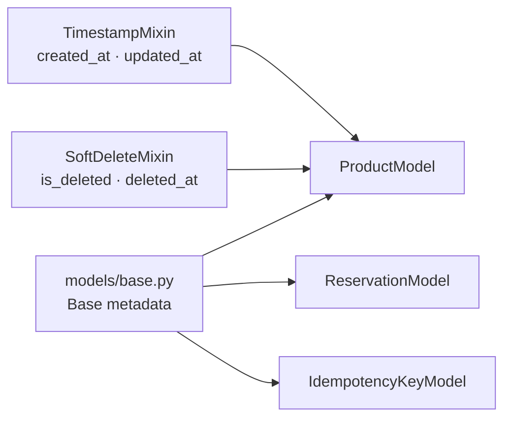
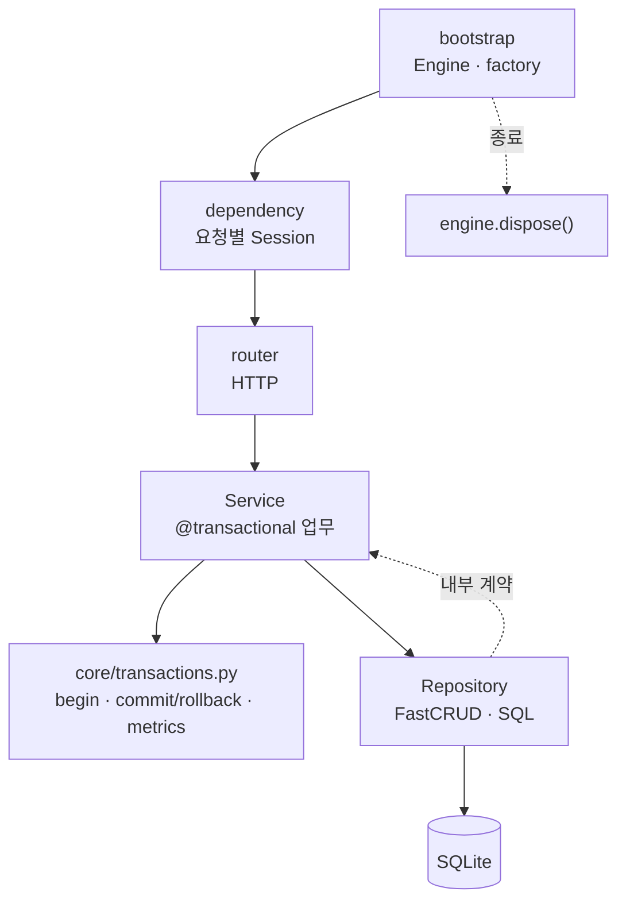

# Python / FastAPI + FastCRUD 독립 변형

Status: **IMPLEMENTED · VERIFIED LOCALLY** · 독립 변형 설계·검증 · 2026-09-15

## 개요와 사용 방향

이 문서는 현재 [`python/fastapi/`](../../python/fastapi/README.md)을 바꾸지 않고 만든
[`python/fastapi-fastcrud/`](../../python/fastapi-fastcrud/README.md) 독립 앱의 선택과 검증 범위를 소유합니다.
현재 Python/FastAPI 기준선은 SQLAlchemy Core `Table`을 직접 사용하며 구현·검증됐습니다.
FastCRUD 변형은 SQLAlchemy ORM mapped class로 일반 CRUD를 줄이되,
예약의 원자성·멱등성처럼 업무 의미가 있는 흐름은 Service와 명시적 SQL을 유지합니다.

두 앱은 비교 후 하나를 선택해 가져가는 독립 앱입니다. 패키지·lockfile·migration·테스트를 각각 소유하며
공유 framework나 공통 `BaseRepository`를 새로 만들지 않습니다. 네이티브 기본 포트는
`127.0.0.1:18092`이며 Compose·컨테이너·공유 모니터링에는 연결하지 않았습니다.

### 프로젝트 생성 기록

아래 공식 명령으로 프로젝트·의존성·Alembic 환경·lockfile을 생성했습니다.

```sh
uv tool run --from uv==0.12.10 uv init --app --package \
  --name template-fastcrud-api --python 3.14.7 --no-workspace --vcs none \
  python/fastapi-fastcrud
uv tool run --from uv==0.12.10 uv add --project python/fastapi-fastcrud \
  "fastcrud>=0.22.3,<0.23" "sqlalchemy[asyncio]>=2.0.52,<2.1" \
  fastapi aiosqlite alembic pydantic-settings uvicorn prometheus-client
cd python/fastapi-fastcrud
uv tool run --from uv==0.12.10 uv run alembic init -t async migrations
```

`--python`은 기준선과 같은 3.14.7입니다. mapped class와 제약을 정의하고
`Base.metadata`를 `migrations/env.py`의 `target_metadata`에 연결한 뒤 revision을 생성했습니다.

```sh
uv tool run --from uv==0.12.10 uv lock
uv tool run --from uv==0.12.10 uv run --locked alembic revision \
  --autogenerate -m "create reservation tables"
```

생성된 revision의 check·foreign key·unique 제약과 upgrade/downgrade/re-upgrade를 시험했습니다.
앱 lifespan은 table 생성이나 migration을 수행하지 않습니다. 실제 실행 순서는
[`README`](../../python/fastapi-fastcrud/README.md)가 소유합니다.

## FastCRUD 기능과 이 변형의 선택

| FastCRUD가 지원하는 기능 | 이 변형에서의 선택 |
| --- | --- |
| async SQLAlchemy ORM 기반 create/get/update/delete | 단순 관리 데이터의 Repository 함수 안에서 사용합니다. ORM 객체는 Repository 밖으로 반환하지 않습니다. |
| 필터·정렬·offset/cursor pagination·join | 필요한 조회에 한해 명시적으로 노출하고 무제한 `limit=None`은 공개 API에서 허용하지 않습니다. |
| `commit=False`로 커밋 위임 | SQL 실행을 미루는 옵션이 아닙니다. 모든 업무 쓰기에 명시하고 최종 commit/rollback은 Service의 `@transactional` 경계가 소유합니다. |
| `schema_to_select`와 `return_as_model` 반환 | create 결과가 필요하면 둘을 지정합니다. 생략하면 `create()`는 `None`을 반환합니다. |
| `crud_router` 자동 endpoint | 인증 없는 로컬 관리 CRUD 데모에만 선택적으로 사용합니다. 예약 흐름에는 사용하지 않습니다. |
| soft delete·bulk/upsert·관계 포함 | soft delete는 변경 가능한 `ProductModel`에만 opt-in합니다. 전역 필터·자동 endpoint·복구 API는 만들지 않습니다. 나머지는 제품 요구가 생긴 뒤 도입합니다. |

FastCRUD 0.22.3의 `create(..., commit=False)`는 내부에서 `flush()`와 `refresh()`를 수행하지만 commit하지 않습니다.
`schema_to_select`가 없으면 반환은 `None`이며, 지정하면 기본은 `dict`, `return_as_model=True`이면 해당 Pydantic
모델을 반환합니다. 이 동작은 버전 변경 시 회귀 시험으로 다시 고정합니다.

## 구현 구조와 구성 요소

`src/`와 `tests/`는 형제이며, 실제 책임이 생긴 파일만 만듭니다. 아래 소스 경로는 공통으로
`src/template_fastcrud_api/` 아래에 있으며, 폴더가 빈 package를 미리 만들라는 뜻은 아닙니다.

| 경로 (`python/fastapi-fastcrud/` 기준) | 역할 |
| --- | --- |
| `bootstrap/` | 앱 factory·lifespan·router·예외 handler를 조립하고 Engine을 정리합니다. |
| `dependencies/` | 요청마다 새 `AsyncSession`과 clock 같은 HTTP dependency를 제공합니다. 자동 commit하지 않습니다. |
| `models/base.py` | Alembic과 모든 mapped class가 공유하는 `DeclarativeBase` metadata만 소유합니다. |
| `models/mixins.py` | 독립 조합 가능한 UTC timestamp·soft-delete column과 SQLite UTC 복원 타입을 소유합니다. |
| `models/reservations.py` | product·reservation·idempotency mapped class와 DB 제약을 소유합니다. |
| `repositories/` | FastCRUD 호출과 특수 SQL, ORM↔내부 계약 변환을 소유합니다. commit하지 않습니다. |
| `services/` | `@transactional`로 업무 범위를 표시하고 순서·정책을 소유합니다. HTTP schema와 ORM을 반환하지 않습니다. |
| `contracts/` | HTTP·Pydantic·ORM과 분리한 불변 업무 입력·결과를 소유합니다. |
| `schemas/` | 공개 HTTP 요청·응답과 envelope를 소유합니다. Router에서 내부 계약으로 변환합니다. |
| `routers/` | HTTP 검증·응답 변환을 수행하고 Service를 호출합니다. |
| `core/` | settings·DB Engine/Session factory·`@transactional` 실행·clock·logging·metrics를 소유합니다. |
| `http/` | Problem 응답, 예외 변환, ASGI 관측 경계를 소유합니다. |
| `tests/` | 역할 단위 시험과 예약·경합·재생·migration 시나리오를 둡니다. 소스와 일대일 파일을 강제하지 않습니다. |
| `migrations/` · `alembic.ini` | ORM metadata를 읽는 Alembic 환경과 검토된 revision을 소유합니다. |

함수 중심으로 시작합니다. 범용 `BaseRepository`, Unit of Work, 비어 있는 Facade는 만들지 않습니다.
여러 업무를 실제로 조합할 때만 `services/<업무>.py` 함수가 조합 책임을 맡습니다.



| 모델 | timestamp mixin | soft-delete mixin | 이유 |
| --- | --- | --- | --- |
| `ProductModel` | 적용 | 적용 | 재고 변경과 논리 삭제를 audit합니다. |
| `ReservationModel` | 미적용 | 미적용 | 기존 불변 `created_at` 문자열과 공개 응답 직렬화를 그대로 유지합니다. |
| `IdempotencyKeyModel` | 미적용 | 미적용 | 저장된 성공 snapshot의 정확한 재생 계약을 그대로 유지합니다. |

## 런타임과 transaction 소유권



FastCRUD는 Repository 구현 도구이지 transaction 경계가 아닙니다. HTTP dependency는 Session 생성·정리만 하고,
Service의 `@transactional`이 `core/transactions.py`에서 한 업무의 begin·write connection·commit/rollback·오류 번역·
계측을 실행합니다. Service signature는 required keyword-only `session`, `metrics`를 명시합니다. Repository의 모든 쓰기는
`commit=False`를 유지합니다. 같은 Task·Session의 decorated 중첩 호출만 바깥 transaction에 참여하며 내부 실패를 잡아도
rollback-only입니다. 다른 Task의 동시 Session 사용과 사전/autobegin transaction은 거절합니다.
수동 begin/commit/rollback, 자동 SAVEPOINT·REQUIRES_NEW·readOnly·Replica routing은 지원하지 않습니다.

`repositories/reservations.py`의 `ProductCreate`·`ProductSelect`·
`ReservationCreate`·`IdempotencyCreate`·`IdempotencySelect`는 FastCRUD 저장
경계 전용 Pydantic 입력입니다. HTTP schema와 공유하지 않습니다. `create_product`는
라이브러리 동작을 보여 주는 Repository 예제이며 공개 product CRUD endpoint는 만들지 않았습니다.
반환이 필요한 product create/get만 `schema_to_select`와 `return_as_model=True`를
사용하고 내부 `Product` contract로 변환합니다. 예약·멱등 키 create는 반환이 필요하지
않아 기본 `None`을 사용합니다.

## 예약은 명시적 SQL로 유지합니다

예약은 일반 CRUD가 아닙니다. 키 재생 확인 → 조건부 재고 차감 → 예약과 성공 snapshot 저장을 같은 transaction에서
수행합니다. 다음 SQLAlchemy 문장은 현재 기준선과 같은 원자적 조건을 보존하며 Repository 안에 둡니다.

SQLite 예약 decorator는 `session.begin()`에 들어간 직후 `acquire_primary_connection(..., write=True)`로
`BEGIN IMMEDIATE` 연결을 명시적으로 획득하고, 그 다음에 첫 멱등 키 조회를 수행합니다. `session.begin()`만으로
writer 선점을 대신하지 않으며, 같은 키 경합을 키 조회 전부터 SQLite의 제한 시간 안에서 직렬화합니다.

```python
changed = await session.scalar(
    update(ProductModel)
    .where(
        ProductModel.id == product_id,
        ProductModel.available > 0,
        ProductModel.is_deleted.is_(False),
    )
    .values(available=ProductModel.available - 1)
    .returning(ProductModel.id)
)
```

`changed is None`이면 같은 transaction에서 활성 상품 존재 여부를 확인해 `PRODUCT_NOT_FOUND`와 `SOLD_OUT`을 구분합니다.
선조회 후 무조건 차감하는 방식으로 바꾸지 않습니다. 재고 차감·예약·멱등 키·응답 snapshot은 모두 commit되거나 모두
rollback됩니다. 성공 응답은 commit 뒤 만들며, 응답 유실 후 같은 키·같은 입력은 저장된 동일 결과를 재생하고 다른 입력은
`IDEMPOTENCY_CONFLICT`로 거절합니다. 실패로 rollback된 키는 저장하지 않습니다.

멱등 키 조회는 상품 조회보다 먼저이므로 이미 commit된 같은 키의 응답은 이후 상품이 논리 삭제돼도 정확히 재생합니다.
새 키로 삭제 상품을 예약하면 재고 값과 관계없이 `PRODUCT_NOT_FOUND`입니다.

SQLite는 첫 검증 DB이며 단일 writer 제약 아래 독립 연결·프로세스 경합을 시험합니다. PostgreSQL은 이후 별도 단계에서
driver·타입·제약·격리·잠금·경합 시험을 다시 수행합니다. Replica 배포나 읽기 분산은 이 구현에 포함하지 않습니다.

기존 HTTP/DB metrics는 transaction 완료 시점, SQLAlchemy event 연결, label cardinality,
FastCRUD query 경로를 동일한 시험으로 다시 확인했습니다. 두 앱의 process-local registry는
독립이며 실행 중 수치를 서로 합산하지 않습니다.

## `crud_router`의 제한된 용도

`crud_router`는 인증이 없는 별도의 로컬 관리 CRUD 데모에서만 선택적으로 구성하며 운영에 공개하지 않습니다.
허용 method, 입력/응답 schema, pagination 상한, 오류와 응답 envelope를 맞춰야 하며 기본 생성 결과가 이 저장소의
응답 계약을 자동 충족한다고 가정하지 않습니다. 운영 인증·자원 권한은 제품 요구가 생긴 뒤 별도 단계에서 추가합니다.
예약처럼 조건부 SQL·멱등성·결과 재생이 필요한 흐름은 custom Router → Service → Repository 경로를 사용합니다.

## ORM metadata와 Alembic

현재 기준선의 Core `Table`을 `DeclarativeBase`를 상속한 ORM mapped class로 옮겼습니다.
DB column·unique/check/foreign-key 제약은 모델과 revision에 함께 있습니다. Alembic `migrations/env.py`는 모든
mapped class가 등록된 Base를 import하고 `target_metadata = Base.metadata`로 설정합니다. 빈 DB의 `upgrade head`,
downgrade/re-upgrade와 `alembic check`를 검증하며 `Base.metadata.create_all()`은 앱 시작 경로에 두지 않습니다.

## Product audit timestamp와 opt-in soft delete

`TimestampMixin`은 Python `system_clock()`의 aware UTC 값으로 `created_at`·`updated_at`을 만들고 ORM/Core update에
`updated_at`을 갱신합니다. FastCRUD 0.22.3의 update·delete도 aware UTC를 기록합니다. `UTCDateTime`은
`DateTime(timezone=True)`를 사용하고 SQLite가 timezone 정보를 제거해 반환한 값만 UTC로 복원합니다. 이는 PostgreSQL의
timezone-aware column 선택과도 일치하는 타입 의도이지만 PostgreSQL 동작을 검증했다는 뜻은 아닙니다.

이 시각은 ORM persistence audit 시각이며 예약 Service에 주입하는 업무 clock과 구분합니다. ORM 경로 밖의 bulk/raw SQL은
자동 갱신을 보장하지 않으므로 필요한 audit 값을 SQL에 명시해야 합니다. 이전 revision의 product는 새 migration 실행 시작
시각 하나를 `created_at`·`updated_at`에 backfill합니다. 이는 과거 생성 시각이 아니라 legacy row의 audit 시작 근사치입니다.
최종 schema에는 계속 적용되는 server default를 남기지 않습니다.
SQLite parent table의 batch 재생성 동안 migration 전용 연결만 FK enforcement를 잠시 끄고, 같은 migration transaction 안에서
`foreign_key_check`를 통과해야 commit합니다. 위반 시 schema·data·Alembic revision을 함께 rollback한 뒤 FK 설정을 복구합니다.

`SoftDeleteMixin`은 `is_deleted=False`와 nullable `deleted_at`을 독립적으로 제공하며 현재는 `ProductModel`만 조합합니다.
삭제는 FastCRUD `delete(..., commit=False)`로 바깥 transaction에 참여합니다. 활성 product 조회와 조건부 재고 차감은
`is_deleted=False`를 명시합니다. product ID는 전체 table primary key라 삭제 후에도 재사용하거나 자동 부활시키지 않습니다.
seed의 `ON CONFLICT DO NOTHING`도 재고와 삭제 상태를 바꾸지 않으며, 삭제 ID를 seed하면 후속 `get_product`가
`ProductNotFound`를 반환합니다. 전역 query filter, restore API, 자동 CRUD/delete HTTP endpoint는 범위 밖입니다.

## 구현·검증 상태

| 단계 | 상태 | 확인 내용 |
| --- | --- | --- |
| 설정·migration | 완료 | 독립 Python/package/lock/DB와 ORM metadata, Alembic revision을 생성했습니다. |
| FastCRUD 경계 | 완료 | product create/get, reservation·idempotency create, key get에 FastCRUD 0.22.3을 사용합니다. |
| product audit·soft delete | 완료 | UTC create/update, FastCRUD delete, 활성 조회·재고 필터, rollback·seed·재생 정책을 검증했습니다. |
| 예약 계약 | 완료 | 조건부 차감·snapshot·멱등성·commit 실패·thread/process 경합을 독립 SQLite에서 시험합니다. |
| transaction 실행 | 완료 | `@transactional`의 중첩·rollback-only·소유권·오류 번역·두 outcome과 Session 재사용을 시험합니다. |
| HTTP·관측 | 완료 | 기존 envelope·Problem·health·logging·HTTP/DB metrics 계약을 같은 의미로 시험합니다. |
| 후속 | 미구현 | `crud_router`, pagination 공개 API, 인증, PostgreSQL, Compose·운영 배포입니다. |

2026-09-15 로컬 검증 결과는 다음과 같습니다.

- Python 3.14.7, FastAPI 0.141.1, FastCRUD 0.22.3, SQLAlchemy 2.0.53,
  Uvicorn 0.53.0을 lockfile 환경에서 확인했습니다.
- Ruff check·format check와 ty가 통과했고 전체 pytest는 106개가 통과했습니다.
  Starlette 1.6.0의 `anyio.abc.BlockingPortal` 별칭 경고 1건은 기준선과 같은
  좁은 filter로 표시합니다.
- 새 audit migration은 빈 DB의 upgrade/check/downgrade/re-upgrade뿐 아니라 이전 revision의 product·reservation·
  idempotency snapshot을 채운 DB에서도 기존 값 보존, UTC backfill, FK 무결성을 검증했습니다. 의도한 FK 위반에서는
  schema·data·revision이 모두 이전 상태로 rollback되는 것도 확인했습니다. ORM/Core/FastCRUD update의
  `updated_at`, 생성 시각 유지, delete commit/rollback, 삭제 상품 조회·재고·seed·ID 재사용 거절과 commit된 키 재생도
  격리 SQLite에서 확인했습니다.
- uv build가 wheel과 sdist를 만들었고 패키지에 `.env`, data, 가상환경,
  test DB가 포함되지 않았습니다.
- 새 임시 SQLite에서 Alembic upgrade/check/downgrade/re-upgrade/check가 통과했습니다.
- 격리한 `127.0.0.1:54709`에서 docs·readiness·greeting·HTTP/DB metrics,
  예약 성공·같은 키 재생·다른 입력 충돌을 확인한 뒤 서버를 종료했습니다.

PostgreSQL·인증·운영 배포·Compose·`crud_router`는 검증하거나 구현하지 않았습니다.

## 근거

확인일: 2026-09-15. uv lock과 설치 환경에서 FastCRUD 0.22.3의 실제 signature와
`create` 구현을 확인했습니다.

- [FastCRUD 저장소와 기능·요구사항](https://github.com/benavlabs/fastcrud)
- [고급 CRUD와 `commit=False`](https://benavlabs.github.io/fastcrud/advanced/crud/)
- [`FastCRUD.create` API와 반환 동작](https://benavlabs.github.io/fastcrud/api/fastcrud/)
- [`crud_router` 사용과 생성 endpoint](https://benavlabs.github.io/fastcrud/usage/endpoint/)
- [uv project 생성](https://docs.astral.sh/uv/concepts/projects/init/) · [uv 의존성 관리](https://docs.astral.sh/uv/concepts/projects/dependencies/)
- [Alembic asyncio 환경](https://alembic.sqlalchemy.org/en/latest/cookbook.html#using-asyncio-with-alembic) · [Alembic tutorial](https://alembic.sqlalchemy.org/en/latest/tutorial.html)
