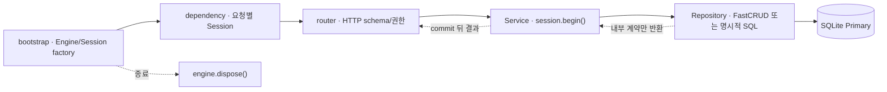

# Python / FastAPI + FastCRUD 제안

Status: **PROPOSED · NOT IMPLEMENTED** · 독립 변형 설계 · 2026-09-15

## 개요와 사용 방향

이 문서는 현재 [`python/fastapi/`](../../python/fastapi/README.md)을 바꾸지 않고,
`python/fastapi-fastcrud/`에 별도 FastAPI + FastCRUD 변형을 만든다면 어떻게 구성하고 사용하는지 제안합니다.
현재 Python/FastAPI 기준선은 SQLAlchemy Core `Table`을 직접 사용하며 구현·검증됐습니다.
제안 변형은 FastCRUD가 요구하는 SQLAlchemy ORM mapped class로 일반 CRUD를 줄이되,
예약의 원자성·멱등성처럼 업무 의미가 있는 흐름은 Service와 명시적 SQL을 유지합니다.

두 앱은 비교 후 하나를 선택해 가져가는 독립 앱입니다. 패키지·lockfile·migration·테스트를 각각 소유하며
공유 framework나 공통 `BaseRepository`를 새로 만들지 않습니다. 이 문서의 경로·명령·코드는 모두 향후 설정안이며,
현재 실행 가능한 앱·Compose selector·포트가 있다는 뜻이 아닙니다.

### 향후 초기 설정

아래는 변형 구현을 시작하기로 결정한 뒤 저장소 루트에서 수행할 **예정 명령**입니다.
`uv init`과 `uv add`, Alembic CLI가 생성·의존성·migration 환경을 소유합니다.

```sh
uv init --app --name backend-template-fastcrud python/fastapi-fastcrud
cp python/fastapi/.python-version python/fastapi-fastcrud/.python-version
uv add --project python/fastapi-fastcrud \
  fastapi fastcrud sqlalchemy aiosqlite alembic pydantic-settings uvicorn prometheus-client
cd python/fastapi-fastcrud
uv run alembic init -t async migrations
uv run alembic revision --autogenerate -m "create reservation tables"
uv run alembic upgrade head
```

`.python-version`은 새 최신값을 고르지 않고 현재 기준선이 선택한 값(`python/fastapi/.python-version`)을 복사합니다.
의존성 버전은 실제 착수 시 uv가 만든 lockfile과 Python 호환성을 함께 검증합니다. `revision --autogenerate` 결과는
그대로 신뢰하지 않고 제약·인덱스·upgrade/downgrade를 검토합니다. 앱 lifespan에서 table을 만들거나 migration을 실행하지 않습니다.

구현 뒤 사용 흐름은 migration 적용 → seed 또는 fixture 준비 → API 실행 → 일반 CRUD와 예약 계약 시험 순서입니다.
검증 전에는 구체적인 실행 명령, 주소, 컨테이너 실행법을 사용 안내로 승격하지 않습니다.

## FastCRUD 기능과 이 변형의 선택

| FastCRUD가 지원하는 기능 | 이 변형에서의 선택 |
| --- | --- |
| async SQLAlchemy ORM 기반 create/get/update/delete | 단순 관리 데이터의 Repository 함수 안에서 사용합니다. ORM 객체는 Repository 밖으로 반환하지 않습니다. |
| 필터·정렬·offset/cursor pagination·join | 필요한 조회에 한해 명시적으로 노출하고 무제한 `limit=None`은 공개 API에서 허용하지 않습니다. |
| `commit=False`로 쓰기 지연 | 모든 업무 쓰기에 명시합니다. 최종 commit/rollback은 바깥 Service의 `session.begin()`이 소유합니다. |
| `schema_to_select`와 `return_as_model` 반환 | create 결과가 필요하면 둘을 지정합니다. 생략하면 `create()`는 `None`을 반환합니다. |
| `crud_router` 자동 endpoint | 접근 통제가 단순한 관리용 CRUD 데모에만 선택적으로 사용합니다. 예약 흐름에는 사용하지 않습니다. |
| soft delete·bulk/upsert·관계 포함 | 제품 요구와 실패 계약을 먼저 정한 뒤 도입합니다. 템플릿 기본 기능으로 켜지 않습니다. |

FastCRUD 0.22.3의 `create(..., commit=False)`는 내부에서 `flush()`와 `refresh()`를 수행하지만 commit하지 않습니다.
`schema_to_select`가 없으면 반환은 `None`이며, 지정하면 기본은 `dict`, `return_as_model=True`이면 해당 Pydantic
모델을 반환합니다. 이 동작은 버전 변경 시 회귀 시험으로 다시 고정합니다.

## 제안 구조와 구성 요소

`src/`와 `tests/`는 형제이며, 실제 책임이 생긴 파일만 만듭니다. 아래 폴더가 빈 package를 미리 만들라는 뜻은 아닙니다.

| 경로 (`python/fastapi-fastcrud/` 기준) | 역할 |
| --- | --- |
| `src/template_fastcrud_api/bootstrap/` | 앱 factory·lifespan·router·예외 handler를 조립하고 Engine을 정리합니다. |
| `src/template_fastcrud_api/dependencies/` | 요청마다 새 `AsyncSession`과 clock 같은 HTTP dependency를 제공합니다. 자동 commit하지 않습니다. |
| `src/template_fastcrud_api/models/` | `DeclarativeBase`와 ORM mapped class, DB 제약을 소유합니다. |
| `src/template_fastcrud_api/repositories/` | FastCRUD 호출과 특수 SQL, ORM↔내부 계약 변환을 소유합니다. commit하지 않습니다. |
| `src/template_fastcrud_api/services/` | 업무 순서·정책·transaction 경계를 소유합니다. HTTP schema와 ORM을 반환하지 않습니다. |
| `src/template_fastcrud_api/contracts/` | HTTP·Pydantic·ORM과 분리한 불변 업무 입력·결과를 소유합니다. |
| `src/template_fastcrud_api/schemas/` | 공개 HTTP 요청·응답과 envelope를 소유합니다. Router에서 내부 계약으로 변환합니다. |
| `src/template_fastcrud_api/routers/` | HTTP 검증·권한 문맥·응답 변환을 수행하고 Service를 호출합니다. |
| `src/template_fastcrud_api/core/` | settings·DB Engine/Session factory·clock·logging·metrics를 소유합니다. |
| `src/template_fastcrud_api/http/` | Problem 응답, 예외 변환, ASGI 관측 경계를 소유합니다. |
| `tests/` | 역할 단위 시험과 예약·경합·재생·migration 시나리오를 둡니다. 소스와 일대일 파일을 강제하지 않습니다. |
| `migrations/` · `alembic.ini` | ORM metadata를 읽는 Alembic 환경과 검토된 revision을 소유합니다. |

함수 중심으로 시작합니다. 범용 `BaseRepository`, transaction runner, 비어 있는 Facade는 만들지 않습니다.
여러 업무를 실제로 조합할 때만 `services/<업무>.py` 함수가 조합 책임을 맡습니다.

## 런타임과 transaction 소유권



FastCRUD는 Repository 구현 도구이지 transaction 경계가 아닙니다. HTTP dependency는 Session 생성·정리만 하고,
Service가 `async with session.begin()`으로 한 업무의 commit/rollback을 결정합니다. Repository의 모든 쓰기는
`commit=False`를 명시하며 내부 Service나 Repository가 중첩 `begin()`을 열지 않습니다. 한 Session을 동시 task에 공유하지 않습니다.

<details>
<summary>예시: 일반 CRUD Repository와 Service (설명용, 전체 앱으로 실행할 수 없음)</summary>

```python
# repositories/products.py
from fastcrud import FastCRUD
from pydantic import BaseModel
from sqlalchemy.ext.asyncio import AsyncSession

from template_fastcrud_api.contracts.products import CreateProduct, ProductRecord
from template_fastcrud_api.models.products import Product


class _ProductCreate(BaseModel):
    id: str
    available: int


class _ProductSelected(BaseModel):
    id: str
    available: int


product_crud = FastCRUD(Product)


async def create_product(
    session: AsyncSession, command: CreateProduct
) -> ProductRecord:
    selected = await product_crud.create(
        db=session,
        object=_ProductCreate(id=command.product_id, available=command.stock),
        commit=False,
        schema_to_select=_ProductSelected,
        return_as_model=True,
    )
    return ProductRecord(product_id=selected.id, available=selected.available)
```

```python
# services/products.py
from sqlalchemy.ext.asyncio import AsyncSession

from template_fastcrud_api.contracts.products import CreateProduct, ProductRecord
from template_fastcrud_api.repositories.products import create_product


async def register_product(
    session: AsyncSession, command: CreateProduct
) -> ProductRecord:
    async with session.begin():
        result = await create_product(session, command)
    return result
```

Repository의 `_ProductCreate`와 `_ProductSelected`는 FastCRUD 저장 경계 전용이며 HTTP schema가 아닙니다.
FastCRUD가 `commit=False` create에서 수행하는 flush+refresh 뒤 필요한 열만 내부 `ProductRecord`로 옮깁니다.
Service에는 FastAPI `Depends`, HTTP schema, ORM mapped class가 들어오거나 나가지 않습니다.

</details>

## 예약은 명시적 SQL로 유지합니다

예약은 일반 CRUD가 아닙니다. 키 재생 확인 → 조건부 재고 차감 → 예약과 성공 snapshot 저장을 같은 transaction에서
수행합니다. 다음 SQLAlchemy 문장은 현재 기준선과 같은 원자적 조건을 보존하며 Repository 안에 둡니다.

```python
changed = await session.scalar(
    update(Product)
    .where(Product.id == product_id, Product.available > 0)
    .values(available=Product.available - 1)
    .returning(Product.id)
)
```

`changed is None`이면 같은 transaction에서 상품 존재 여부를 확인해 `PRODUCT_NOT_FOUND`와 `SOLD_OUT`을 구분합니다.
선조회 후 무조건 차감하는 방식으로 바꾸지 않습니다. 재고 차감·예약·멱등 키·응답 snapshot은 모두 commit되거나 모두
rollback됩니다. 성공 응답은 commit 뒤 만들며, 응답 유실 후 같은 키·같은 입력은 저장된 동일 결과를 재생하고 다른 입력은
`IDEMPOTENCY_CONFLICT`로 거절합니다. 실패로 rollback된 키는 저장하지 않습니다.

SQLite는 첫 검증 DB이며 단일 writer 제약 아래 독립 연결·프로세스 경합을 시험합니다. PostgreSQL은 이후 별도 단계에서
driver·타입·제약·격리·잠금·경합 시험을 다시 수행합니다. Replica 배포나 읽기 분산은 이 제안에 포함하지 않습니다.

기존 HTTP/DB metrics는 이름만 보고 복사하지 않습니다. transaction 완료 시점, SQLAlchemy event 연결, label cardinality,
FastCRUD가 추가하는 query 경로를 확인한 뒤 같은 의미가 증명되는 지표만 재사용합니다. 미검증 수치를 기준선과 합산하지 않습니다.

## `crud_router`의 제한된 용도

`crud_router`는 별도의 단순 관리 CRUD 데모에서만 선택적으로 구성합니다. 공개 endpoint마다 인증·자원 권한,
허용 method, 입력/응답 schema, pagination 상한, 오류와 응답 envelope를 맞춰야 합니다. 기본 생성 결과가 이 저장소의
접근 통제와 응답 계약을 자동 충족한다고 가정하지 않습니다. 예약처럼 조건부 SQL·멱등성·결과 재생이 필요한 흐름은
custom Router → Service → Repository 경로를 사용합니다.

## ORM metadata와 Alembic

현재 기준선의 Core `Table`은 제안 변형에서 `DeclarativeBase`를 상속한 ORM mapped class로 옮깁니다.
DB column·unique/check/foreign-key 제약은 모델과 revision에서 함께 검토합니다. Alembic `migrations/env.py`는 모든
mapped class가 등록된 Base를 import하고 `target_metadata = Base.metadata`로 설정합니다. 빈 DB의 `upgrade head`, 기존
revision에서 upgrade, downgrade 정책, `alembic check`를 검증하며 `Base.metadata.create_all()`은 앱 시작 경로에 두지 않습니다.

## 단계별 작업 제안

| 단계 | 작업 | 완료 기준 |
| --- | --- | --- |
| 1. 설정 | uv app·기준 Python·의존성·settings·Engine/Session·Alembic 환경을 만듭니다. | lockfile 재현, 앱별 자원 격리, 시작 실패와 dispose, 빈 DB migration이 통과합니다. |
| 2. ORM·일반 CRUD | mapped class와 함수형 Repository, 작은 관리 CRUD를 추가합니다. | `commit=False`와 반환 schema 동작, rollback, ORM 비노출, pagination 상한을 시험합니다. |
| 3. 예약 계약 | 조건부 차감·멱등 키·snapshot과 Service transaction을 옮깁니다. | 정상·품절·없는 상품·저장 실패·같은/다른 키 경합·응답 유실 재생이 통과합니다. |
| 4. 통합 검증 | HTTP 오류/envelope·권한·관측·migration 회귀를 연결합니다. | metrics 의미를 재검증하고 SQLite 전체 시험과 strict 문서 build가 통과합니다. |
| 5. 가이드 | 검증된 실행·seed·종료 절차만 사용 안내에 올립니다. | 새 사용자가 문서 명령으로 재현하며 미구현 PostgreSQL·배포 범위가 분리됩니다. |

## 근거

확인일: 2026-09-15. FastCRUD 최신 확인 버전은 0.22.3(2026-06-21)이며 구현 착수 시 다시 확인합니다.

- [FastCRUD 저장소와 기능·요구사항](https://github.com/benavlabs/fastcrud)
- [고급 CRUD와 `commit=False`](https://benavlabs.github.io/fastcrud/advanced/crud/)
- [`FastCRUD.create` API와 반환 동작](https://benavlabs.github.io/fastcrud/api/fastcrud/)
- [`crud_router` 사용과 생성 endpoint](https://benavlabs.github.io/fastcrud/usage/endpoint/)
- [uv project 생성](https://docs.astral.sh/uv/concepts/projects/init/) · [uv 의존성 관리](https://docs.astral.sh/uv/concepts/projects/dependencies/)
- [Alembic asyncio 환경](https://alembic.sqlalchemy.org/en/latest/cookbook.html#using-asyncio-with-alembic) · [Alembic tutorial](https://alembic.sqlalchemy.org/en/latest/tutorial.html)
