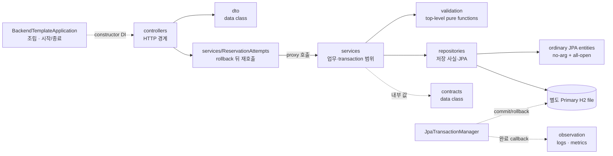

# Kotlin Spring Boot 폴더 구조와 활용 기준

Status: **Task 1–8 실제 파일 기준 · 자동 시험 38개 통과** · 2026-09-16

대상은 독립 앱 `kotlin/spring-boot/`이며 package는 `com.backendtemplate`입니다.
공통 Spring/JPA 책임은 [Java 구조](spring-boot-structure.md), Kotlin 고유 선택과 transaction은
[Kotlin 구현 설계](kotlin-spring-boot.md)를 봅니다. 실행 증거는
[검증 기록](kotlin-spring-boot-verification.md)에 있습니다.



## 실제 경로

```text
kotlin/spring-boot/
├── .java-version
├── build.gradle.kts
├── settings.gradle.kts
├── gradle.lockfile
├── gradle/wrapper/
└── src/
    ├── main/
    │   ├── kotlin/com/backendtemplate/
    │   │   ├── BackendTemplateApplication.kt
    │   │   ├── config/
    │   │   ├── contracts/
    │   │   ├── controllers/
    │   │   ├── dto/
    │   │   ├── exceptions/
    │   │   ├── http/
    │   │   ├── observation/
    │   │   ├── repositories/
    │   │   ├── services/
    │   │   └── validation/
    │   └── resources/
    │       ├── META-INF/spring.factories
    │       ├── application.yaml
    │       ├── application-no-db.yaml
    │       ├── application-seed.yaml
    │       └── db/migration/
    └── test/
        ├── kotlin/com/backendtemplate/
        └── java/com/backendtemplate/
```

## 책임 배치

| 영역 | 실제 책임 |
| --- | --- |
| `BackendTemplateApplication.kt` | `runApplication`, seed profile/non-web 실행, 시작 실패 기록·종료 |
| `config/` | immutable configuration properties, UTC `Clock`, no-db 환경 전처리, `JpaTransactionManager`, seed, OpenAPI |
| `controllers/` | nullable 외부 입력 수신, 형식 검증, service 호출, contract→DTO 변환과 protocol header |
| `dto/` | Jackson 공개 계약. `data class`·`val`, snake_case annotation, typed root/health/data/Problem/field errors |
| `http/` | top-level input functions, 예약 deserializer, Problem 번역, fallback error, request ID/MDC filter |
| `services/` | primary-constructor DI, public proxy transaction, 조회·검증·변경 순서 |
| `validation/` | DB·Spring 의존성이 없는 top-level 업무 조건 함수 |
| `repositories/` | nullable 조회 결과, Spring Data query, EntityManager persist/flush, entity→contract 변환 |
| `repositories/*Entity.kt` | `data class`가 아닌 ordinary JPA entity. 필요한 `var`와 제한된 변경 표면만 보유 |
| `contracts/` | HTTP/JPA와 분리된 immutable `data class` 결과 |
| `exceptions/` | 업무 실패 reason과 rollback 뒤 복구 신호 |
| `observation/` | Servlet 완료 로그 정리와 transaction 실제 완료 metrics; 업무 결과를 덮지 않음 |

Bean은 `class GreetingService(private val clock: Clock)` 같은 단일 primary constructor를 사용합니다.
Spring Data interface 외에 빈 interface/Impl을 만들지 않습니다. top-level function은 입력·업무 검증처럼 상태 없는 로직에만 쓰고,
의존성이나 lifecycle을 숨기는 file singleton으로 사용하지 않습니다. `companion object`는 Java callback이 실제 static entry를
요구할 때만 검토하고 공통 utility 보관소로 쓰지 않습니다.

JPA entity에는 source-level 기본값이나 nullable field를 no-arg 생성자용으로 억지로 넣지 않습니다.
`plugin.jpa`의 synthetic constructor와 entity `allOpen` 설정을 사용하되, 실제 Hibernate load와 proxy 시험이 이 선택을 증명해야 합니다.
entity는 repositories 밖으로 반환하지 않고 `open-in-view=false`에서 contract 변환을 끝냅니다.

## resource와 실행 경계

`application.yaml`은 native 기본 포트 18093, 기본 DB URL 빈 값, graceful shutdown,
`ddl-auto=validate`, `open-in-view=false`, Actuator/Prometheus/Springdoc와 안전한 JSON logging을 소유합니다.
`application-no-db.yaml`은 DataSource/Flyway/JPA 비활성과 DB 없는 readiness를 소유합니다.
H2 활성 예시는 앱 작업 디렉터리의 `./data/template`을 사용해 Java 데이터와 분리합니다.

V1/V2 migration의 schema·제약 의미는 Java와 같게 새 앱에 복사하되 두 앱의 runtime data file은 공유하지 않습니다.
기존 migration을 수정하는 대신 이후 schema 변경은 다음 version 파일로 추가합니다.
container용 파일과 Compose 연결은 이번 wave에 만들지 않으며 18094는 후속 통합에만 예약합니다.

## 시험 배치

`src/test/kotlin`은 다음 Kotlin 고유·실제 경계 시험을 소유합니다.

- missing/null/number/malformed JSON의 실제 HTTP 422 location/code
- default-final 상태와 compiler plugin 적용 뒤 실제 Spring transaction proxy rollback
- synthetic no-arg/all-open entity의 Hibernate load와 nullable repository miss

Java 구현의 35개 실제 계약 harness는 `src/test/java`로 복사·최소 적응했습니다.
특히 HTTP, 임시 file/TCP H2, 독립 JVM worker, shutdown, migration, commit/rollback fault injection은
언어를 바꾸는 것보다 동일 실패 조건을 보존하는 것이 우선입니다. Kotlin `data class`의 Java accessor 등 interop 차이만
test callsite에서 명시적으로 적응하며 production compatibility accessor/wrapper나 Java source를 남기지 않습니다.
장기적인 test Kotlin 전환은 별도 가치가 생길 때만 합니다.

build 산출물, `.gradle/`, `data/`, 실제 `.env`는 commit하지 않습니다. 고정 shape를 raw string map으로 표현하지 않고,
`Base`, `Facade`, forwarding CRUD wrapper, base repository,
범용 extension 모음, coroutine·WebFlux package는 만들지 않습니다.
