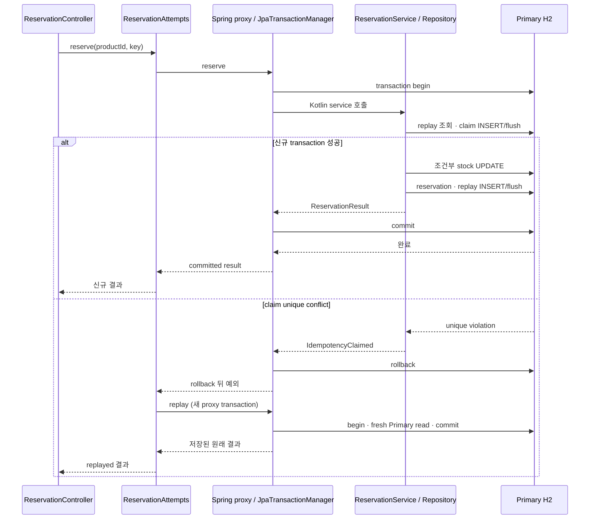

# Kotlin / Spring Boot 구현 설계

Status: **Task 1–10 구현·독립 검토·자동 시험·native 재시작·문서 통합 검증 완료** · 2026-09-16

`kotlin/spring-boot/`는 Java 구현을 대체하거나 호출하지 않는 독립 sibling 앱입니다.
공통 HTTP·DB·관측 계약과 Spring/JPA의 동작은 [Java 구현 설계](spring-boot.md),
[내부 동작](spring-boot-internals.md), [검증 기록](spring-boot-verification.md)을 기준으로 삼고,
이 문서는 Kotlin/JVM에서 달라지는 구현 선택만 소유합니다. 실제 Kotlin 결과는
[Kotlin 검증 기록](kotlin-spring-boot-verification.md)에 있습니다.

## 검증된 도구와 구현

2026-09-16 공식 Initializr metadata와 생성 결과, Spring Boot·Framework·Data 및 Kotlin 공식 문서를 확인했습니다.

| 항목 | 실제 선택 | 확인 근거 |
| --- | --- | --- |
| 생성 | Spring Initializr API, `language=kotlin`, `type=gradle-project-kotlin`, package `com.backendtemplate` | metadata가 Kotlin·Gradle Kotlin DSL·Java 25와 Boot 4.1.1 stable을 제공함 |
| 빌드 | JDK 25, Gradle Wrapper 9.7.1, Kotlin JVM/Spring/JPA plugin 2.3.21, Boot 4.1.1 | 같은 입력의 공식 생성물이 이 조합을 생성함 |
| 서버 | synchronous Spring MVC/Tomcat | Initializr `web`가 `spring-boot-starter-webmvc`를 생성함 |
| 저장 | 단일 Primary H2 file, JPA/Hibernate, Flyway, Hikari | 별도 file·실제 transaction/경합/restart 시험 통과 |
| JSON | Jackson Kotlin module, 명시적인 DTO/deserializer | 공식 생성물이 `tools.jackson.module:jackson-module-kotlin`을 포함함 |
| 포트 | native `127.0.0.1:18093`; 향후 container 게시 `127.0.0.1:18094` 예약 | 저장소 내 sibling 충돌 방지를 위한 프로젝트 결정 |

Initializr 요청은 `bootVersion=4.1.1`, `javaVersion=25`,
`dependencies=web,data-jpa,flyway,h2,validation,actuator`를 사용합니다. metadata가 표시한
stable 목록과 별개로 위 exact version 요청의 생성 성공을 확인했습니다. 생성물을 시작점으로 보존한 뒤
H2 console 의존성을 제거하고 Springdoc·Prometheus와 strict dependency lock을
Java 구현 수준으로 추가했습니다. 후속 upgrade는 같은 공식 경로로 다시 확인하며, 여기 적힌 값이 미래 최신 버전이라는 뜻은 아닙니다.

## Kotlin 경계 선택

- Spring Bean은 primary constructor의 `private val`로 강한 constructor DI를 사용합니다. 단일 생성자에 `@Autowired`를 붙이지 않고
  요청별 값은 인자·지역 변수에만 둡니다.
- 내부 contract, configuration properties, HTTP DTO는 불변 값에 맞는 `data class`와 `val`을 사용합니다.
  `data class`의 `copy`와 `val`은 참조가 가리키는 mutable 객체까지 불변으로 만들지 않으므로 mutable collection을 계약에 넣지 않습니다.
  필드가 고정된 성공·health·저장 snapshot은 typed value로 표현하고 raw `Map<String, String>`으로 대신하지 않습니다.
- JPA entity는 `data class`로 만들지 않습니다. 지연 proxy·식별자 기반 생명주기와 맞지 않는 자동
  `equals/hashCode/toString/copy`를 피하고, `@Entity`를 붙인 ordinary class와 필요한 `var` field를 repositories 안에 둡니다.
- `kotlin("plugin.spring")`은 Spring annotation/meta-annotation이 붙은 class와 member를 proxy 가능하게 엽니다.
  `kotlin("plugin.jpa")`는 JPA annotation class에 reflection용 synthetic no-arg constructor를 만듭니다.
  Initializr가 더한 `allOpen`의 `Entity`, `MappedSuperclass`, `Embeddable` 설정도 유지해 Hibernate proxy 대상 entity를 엽니다.
  entity initializer를 실행하도록 별도 `noArg.invokeInitializers`를 켜지 않습니다.
- nullable 결과는 Kotlin 경계에서 `Reservation?`, `ProductEntity?`처럼 표현하고 Java `Optional`을 업무 코드로 운반하지 않습니다.
  Spring Data Kotlin repository의 단건 부재도 nullable return으로 선언합니다. Java API의 platform type과 reflection 경계는
  compile-time null safety 밖일 수 있으므로 통합 시험을 유지합니다.
- `!!`는 일반 HTTP·설정·repository·service 경계에서 사용하지 않습니다. nullable을 `?: throw ...`, 명시적 분기,
  `requireNotNull` 중 공개 계약에 맞는 방식으로 좁힌 뒤 non-null 타입을 전달합니다.
- 입력 형식 검증 helper와 조회 뒤 업무 검증은 의미 있는 top-level function으로 둡니다.
  모든 함수를 담는 Java식 `object Inputs`·`object ReservationValidation`은 만들지 않습니다.
- `Base`, forwarding interface/Impl, 단일 호출 `Facade`, base repository는 만들지 않습니다.
  claim 실패 transaction 종료 뒤 새 proxy 호출을 보장하는 `ReservationAttempts`만 실제 조합 책임으로 유지합니다.
- Service는 원자적으로 처리할 업무 범위와 순서만 표현합니다. transaction manager/listener, JPA flush 신호 분류,
  DB 오류의 HTTP 번역 같은 기술 machinery는 config·repository·HTTP 경계가 맡으며 Service `try/catch`로 끌어올리지 않습니다.

## 계약 parity

설정 키, no-db 시작, health, greetings, `data` envelope와 Problem Details, request ID,
JSON logs/Micrometer metrics, 예약의 동시성·멱등성·오류는 Java 구현 설계와 HTTP 검증을 그대로 수락 기준으로 사용합니다.
Kotlin 앱의 루트 문구만 구현 이름인 `Hello, Kotlin Spring Boot!`로 구분합니다.

`DB_PRIMARY_URL`이 비면 DB/Flyway/JPA와 예약 Bean·route가 없고 health·greetings·docs·metrics는 정상입니다.
DB를 켜면 `kotlin/spring-boot/data/` 아래의 독립 H2 file을 기본 예시로 사용하며 Java의
`java/spring-boot/data/`를 공유하지 않습니다. `ddl-auto=validate`, `open-in-view=false`, Flyway 단독 schema 소유,
H2 console 비활성, 단일 `JpaTransactionManager`, 기본 REQUIRED를 유지합니다.

Kotlin non-null constructor parameter만으로 JSON 누락과 명시적 null의 공개 오류 code가 자동으로 같아진다고 가정하지 않습니다.
예약 전용 deserializer가 `product_id` 누락은 `REQUIRED`, null·number·boolean·array·object는 `INVALID`,
unknown field·non-object·malformed JSON은 공개 422 Problem으로 변환합니다. DTO에 nullable/default 값을 넣어 누락을 정상 값으로
흡수하지 않습니다. 모든 공개 snake_case는 Jackson annotation으로 고정하고, 오류 원문이나 입력값은 응답·로그에 넣지 않습니다.

## transaction과 fresh read

동기 MVC의 일반 반환 타입과 `JpaTransactionManager`를 사용하며 coroutine, `suspend`, Reactor, WebFlux를 넣지 않습니다.
Kotlin 함수도 Spring AOP proxy 바깥에서 commit된 뒤 호출자에게 결과가 돌아오는 순서는 Java와 같습니다.

`@Transactional(rollbackFor = [Exception::class])`은 type-level `@Service`가 붙은 public method에 둡니다.
이는 `kotlin-spring` plugin이 class와 method를 열어 실제 proxy가 생기게 하는 명시적 조건입니다.
self-invocation·직접 생성으로 transaction이 적용된다고 기대하지 않습니다. claim은 `persist` 뒤 즉시 `flush`하여
재고 변경 전 unique 충돌을 드러내고, 그 좁은 H2 23505/claim INSERT만 `IdempotencyClaimed`로 바꿉니다.
실패 transaction 안에서 조회하지 않고 rollback 완료 뒤 `ReservationAttempts`가 `replay` proxy를 다시 호출합니다.
재고는 `available > 0` 조건부 JPQL UPDATE와 DB CHECK로 보호하며 claim·재고·예약·replay를 같은 transaction에서 확정합니다.

## Kotlin/JVM에서 별도로 확인할 것

| 차이 | 구현 판단 | 필수 증거 |
| --- | --- | --- |
| class/member default final | plugin에만 의존한 `@Service` proxy가 실제 생성되고 transaction rollback이 적용되는지 검사 | proxy type 확인, checked/unchecked failure 후 DB 불변 |
| synthetic JPA constructor와 entity openness | ordinary entity를 source-level 가짜 기본값 없이 Hibernate가 생성·lazy reference할 수 있어야 함 | reflection/Hibernate load, proxy 가능 여부, schema validate |
| Kotlin metadata nullability | compile-time 표현과 Jackson/Spring Data runtime 결과를 별개로 확인 | missing/null/number 422 및 nullable repository miss |
| data class generated methods | contract/DTO에만 사용하고 entity association이나 lazy field를 순회하지 않음 | 실제 HTTP serialization, entity가 data class가 아님을 review |
| top-level function JVM facade | 상태 없는 검증만 배치하고 Bean·전역 registry처럼 사용하지 않음 | HTTP·실제 DB 분기와 code review에서 숨은 의존성 없음 |

Java의 thread-bound transaction, persistence context, flush/commit, conditional update, MDC와 concurrent collection 설명은
[Java 내부 동작](spring-boot-internals.md)을 다시 사용합니다. Kotlin이라고 이 JVM/Spring 의미가 바뀌었다고 주장하지 않습니다.

## 검증 범위와 제외

첫 구현 wave는 Java의 기존 35개 시험 시나리오를 Kotlin 앱에서 모두 실행 가능한 기준선으로 이식했습니다.
HTTP/file DB/독립 JVM/fault-injection harness는 `src/test/java`의 Java integration test로 재사용·최소 적응했습니다.
Jackson/DTO, Kotlin nullability, proxy/final, JPA entity plugin처럼 언어 차이를 직접 검증하는 시험은
`src/test/kotlin`에 작성합니다. production main source는 모두 Kotlin이며 Java production source는 두지 않습니다.
복사한 Java test를 위해 production에 Java식 compatibility accessor나 wrapper를 추가하지 않고 test callsite를 Kotlin getter에 맞춥니다.
시험 언어 전환 자체는 수락 조건이 아니고, 35개 기존 동작과 Kotlin 고유 회귀가 통과하는지가 수락 조건입니다.

실제 H2 시험은 transaction test 자동 rollback에 기대지 않고 독립 연결로 commit 뒤 상태를 확인합니다.
같은 키 replay/conflict, 다른 키 stock 비음수, 저장 실패 전체 rollback, lock/pool/commit 실패,
embedded 재시작, no-db, schema mismatch, 독립 상품 isolation과 rollback 뒤 fresh read를 포함합니다.

현재 Kotlin 구현 범위에는 Compose·Dockerfile·중앙 README/MkDocs 메뉴·공유 모니터링 변경을 포함하지 않습니다.
구현 수락 뒤 coordinator가 README·구현 안내·MkDocs discoverability를 연결하는 별도 통합 task는 전체 작업에 포함합니다.
container 포트 18094만 예약하며 이번 wave에는 구현하지 않습니다. coroutine/WebFlux, PostgreSQL, auth, key 만료,
Replica/sharding, 자동 retry framework, 범용 transaction wrapper도 범위 밖입니다.

## 공식 근거

모두 2026-09-16 확인했습니다.

- [Spring Initializr](https://start.spring.io/)와 [metadata](https://start.spring.io/metadata/client)
- [Spring Boot Kotlin support](https://docs.spring.io/spring-boot/reference/features/kotlin.html)
- [Spring Framework의 Kotlin/Spring proxy·constructor injection 안내](https://docs.spring.io/spring-framework/reference/languages/kotlin/spring-projects-in.html)
- [Kotlin all-open과 kotlin-spring plugin](https://kotlinlang.org/docs/all-open-plugin.html)
- [Kotlin no-arg와 kotlin-jpa plugin](https://kotlinlang.org/docs/no-arg-plugin.html)
- [Spring Data Kotlin null safety](https://docs.spring.io/spring-data/commons/reference/kotlin/null-safety.html)
- [Spring declarative transaction 동작](https://docs.spring.io/spring-framework/reference/data-access/transaction/declarative/tx-decl-explained.html)
