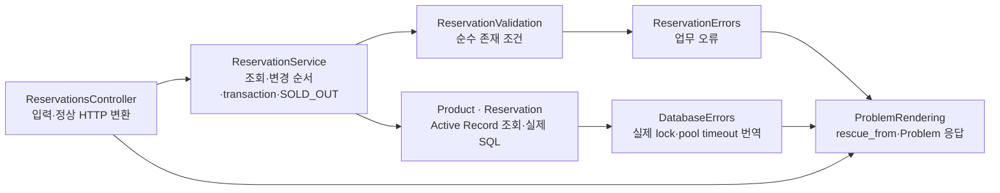

# Rails 폴더 구조와 책임

Status: Task 1~4 및 중앙 HTTP 예외 경계 실제 구조 · 2026-09-16

[구현 색인](README.md) · [Rails 사용 안내](../../ruby/rails/README.md) ·
[구현 설계](rails.md) · [Task](rails-tasks.md)

`ruby/rails/`는 Rails generator의 관용적 역할별 경로를 유지합니다.

```text
app/
  controllers/application_controller.rb
  controllers/concerns/problem_rendering.rb
  controllers/health_controller.rb
  controllers/v1/greetings_controller.rb
  controllers/v1/reservations_controller.rb
  models/application_record.rb
  models/database_errors.rb
  models/greeting_errors.rb
  models/product_id.rb
  models/reservation_errors.rb
  models/reservation_validation.rb
  models/greeting.rb
  models/product.rb
  models/reservation.rb
  models/reservation_result.rb
  services/greeting_service.rb
  services/reservation_service.rb
config/
  application.rb
  database.yml
  puma.rb
  routes.rb
  runtime_settings.rb
db/
  migrate/*_create_reservations.rb
  migrate/*_create_products.rb
  seeds.rb
  schema.rb
test/
  controllers/health_controller_test.rb
  controllers/v1/greetings_controller_test.rb
  controllers/v1/reservations_controller_test.rb
  models/database_configuration_test.rb
  models/migration_compatibility_test.rb
  models/product_test.rb
  models/product_id_test.rb
  models/reservation_test.rb
  models/runtime_settings_test.rb
  services/reservation_service_test.rb
  services/reservation_concurrency_test.rb
```



| 경로 | 책임 |
| --- | --- |
| `controllers/application_controller.rb`, `controllers/concerns/problem_rendering.rb` | native `rescue_from`, 기능·DB 오류의 Problem 변환, 원문 없는 고정 500과 공통 renderer |
| `controllers/v1/greetings_controller.rb` | query 입력, service 호출, 정상 data HTTP 변환 |
| `controllers/health_controller.rb` | liveness와 주입된 DB readiness check의 HTTP 상태 변환 |
| `controllers/v1/reservations_controller.rb` | JSON/path 입력 검증 정책, service 호출, 일반 Ruby 결과의 정상 data HTTP 변환 |
| `models/greeting.rb` | HTTP와 ORM에서 분리된 인사 결과 값 |
| `models/application_record.rb` | Active Record 모델의 Rails 표준 상위 클래스 |
| `models/database_errors.rb` | read/write의 pool timeout과 실제 SQLite lock cause만 기술 오류로 번역 |
| `models/greeting_errors.rb` | 인사 입력 오류 타입과 공개 reason |
| `models/product.rb` | 상품 조회·조건부 재고 UPDATE·반복 안전 seed와 field 제약 |
| `models/product_id.rb` | product ID trim·길이 규칙과 입력 오류 reason을 가진 순수 모듈 |
| `models/reservation_validation.rb` | 제품 존재 boolean과 조회된 예약 존재를 검사하는 순수 업무 검증 |
| `models/reservation_errors.rb` | 입력, 제품·예약 미존재, 품절의 기능 소유 오류 타입 |
| `models/reservation.rb` | `reservations` table 매핑, field 제약, `ReservationResult` 변환 |
| `models/reservation_result.rb` | HTTP·Active Record에서 분리된 예약 결과 값 |
| `services/greeting_service.rb` | 이름 정규화·제약과 주입받은 clock으로 결과 생성, 기능 오류 발생 |
| `services/reservation_service.rb` | ProductId 오류 번역, 조회·순수 검증 호출, 조건부 재고 차감과 예약 INSERT transaction, 실제 차감 실패 뒤 SoldOut, DB 번역 경계 호출, commit 뒤 결과 생성 |
| `config/application.rb` | runtime settings, UTC clock, readiness callable 조립 |
| `config/runtime_settings.rb` | env 파싱과 안전한 시작 검증 |
| `config/database.yml` | 환경별 SQLite 파일·pool·busy timeout, test의 외부 DB env 차단 |
| `db/migrate`, `db/schema.rb`, `db/seeds.rb` | 예약·상품 schema 변경 이력, 현재 schema, 명시적 반복 안전 seed |
| `test/` | 실제 route 요청, SQLite commit/rollback·CHECK·lock, 독립 process 경합, migration upgrade, clock/DB 대체와 DB 파일 격리 검증 |

단순 greeting에는 Active Record 모델을 만들지 않았고 `Greeting`도 DB entity가 아닙니다.
예약은 실제 table을 소유하므로 모델과 migration을 함께 두되 controller는 entity를 직접 serialize하지 않습니다.
예약 Service가 transaction을 소유하고 Product가 SQL을 소유합니다. `reservations.product_id`는 Task 3 데이터를 보존하기 위해
FK 없이 유지하므로 legacy·직접 DB 쓰기의 참조 무결성은 보장하지 않습니다.
ReservationValidation은 boolean 또는 조회된 Reservation만 받고 DB 조회·쓰기·transaction을 수행하지 않습니다.
