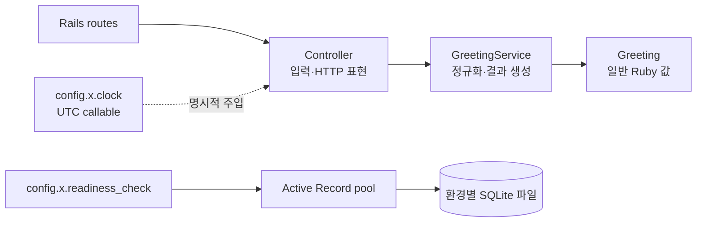

# Rails 구현 설계

Status: Task 1~2 최소 앱 구현·네이티브 검증 완료 · 2026-09-15

## 버전 선택

Ruby 4.0.6과 Rails 8.1.3.1을 고정했습니다. 2026-09-15 기준 Ruby 공식 release 목록의 최신 stable은
[Ruby 4.0.6](https://www.ruby-lang.org/en/downloads/releases/)이고, Rails 공식 release 목록과 RubyGems의 최신 non-yanked gem은
[Rails 8.1.3.1](https://rubygems.org/gems/rails/versions)입니다. 로컬 gemspec에서 Rails 8.1.3.1의 Ruby 요구사항
`>= 3.2.0`을 확인했고 이 조합으로 bundle, eager load, 요청 시험과 실제 boot를 통과했습니다.
Rails 8.1은 2026-10-10까지 bug fix, 2027-10-10까지 security fix 지원 대상이라는
[공식 maintenance 안내](https://rubyonrails.org/2025/10/29/new-rails-releases-and-end-of-support-announcement)도 선택 근거입니다.

Ruby는 ruby-build v20260716으로 홈의 이 저장소 전용 cache에 설치했습니다. 시스템 Ruby, Homebrew Ruby,
global gem account와 shell 기본 설정은 변경하지 않았습니다. 앱 자체는 `.ruby-version`, Gemfile의 `ruby`, Docker build argument에
같은 Ruby 버전을 기록하고 Rails는 Gemfile과 lockfile에서 고정합니다.

## 가장 작은 책임 흐름

인사는 여러 저장 작업을 조합하지 않으므로 DI container, Repository, Base service를 만들지 않습니다.
clock과 readiness는 `Rails.application.config.x`의 callable로 조립해 controller가 명시적으로 전달하거나 호출하고,
요청 시험은 같은 경계를 고정 대역으로 교체합니다. 인사 내부 결과는 `Greeting` 값 객체이며 controller가 공개 JSON으로 변환합니다.

## 설정과 수명

`RuntimeSettings.from_env`가 앱 boot 중 app name, 환경, bind host와 port를 검증하며 입력 원문을 오류에 넣지 않습니다.
Puma thread 수, Active Record pool 수, SQLite busy timeout은 각각 별도 env입니다. 실제 listener bind는 Puma가
`SERVER_HOST`와 `SERVER_PORT`를 사용합니다.

Active Record와 Rails request executor가 connection pool의 획득·반납과 프로세스 수명을 소유합니다.
readiness는 현재 연결에서 실제 `SELECT 1`을 실행하지만 schema revision이나 장기적인 DB 건강을 보장하지 않습니다.
liveness는 DB를 조회하지 않습니다. test 연결은 명시적인 `sqlite3:` URL로 `storage/test.sqlite3`에 고정해
`DB_PRIMARY_PATH`와 Rails의 자동 `DATABASE_URL` merge가 개발·공유 DB를 가리키지 못하게 합니다.
앱 boot가 migration을 숨겨 실행하지 않으며 native 실행 전 필요한 migration은 후속 Task에서 명시합니다.

## 현재와 후속 범위

현재는 greeting data envelope, 최소 입력 Problem 응답, live/ready, 설정 검증, 요청 시험만 제공합니다.
예약 모델·migration·transaction·멱등성·경합, metrics, 공통 404/405/500을 포함한 전체 Problem 처리,
관측과 Compose 연결은 구현됐다고 주장하지 않으며 후속 Task가 소유합니다.
