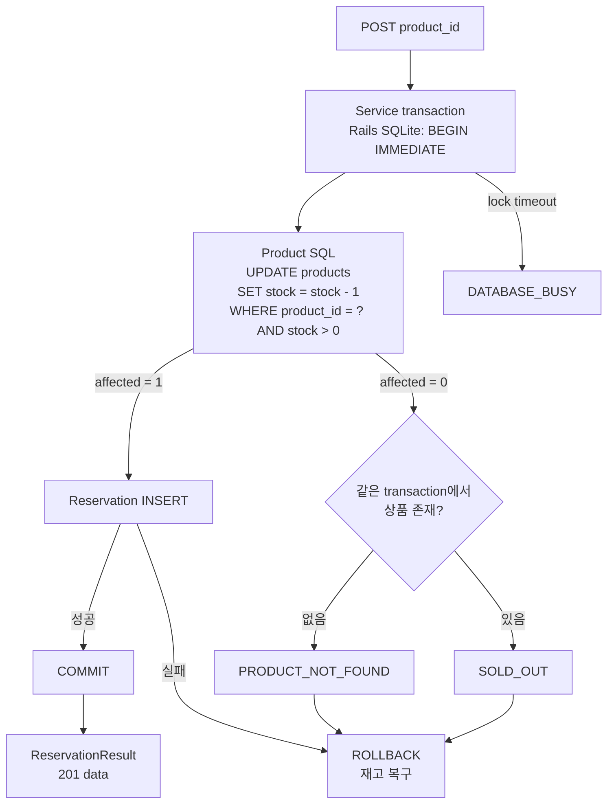

# Rails 구현 설계

Status: Task 1~4 재고 원자성·네이티브 검증 완료 · 2026-09-15

## 버전 선택

Ruby 4.0.6과 Rails 8.1.3.1을 고정했습니다. 2026-09-15 기준 Ruby 공식 release 목록의 최신 stable은
[Ruby 4.0.6](https://www.ruby-lang.org/en/downloads/releases/)이고, Rails 공식 release 목록과 RubyGems의 최신 non-yanked gem은
[Rails 8.1.3.1](https://rubygems.org/gems/rails/versions)입니다. 로컬 gemspec에서 Rails 8.1.3.1의 Ruby 요구사항
`>= 3.2.0`을 확인했고 이 조합으로 bundle, eager load, 요청 시험과 실제 boot를 통과했습니다.
Rails 8.1은 2026-10-10까지 bug fix, 2027-10-10까지 security fix 지원 대상이라는
[공식 maintenance 안내](https://rubyonrails.org/2025/10/29/new-rails-releases-and-end-of-support-announcement)도 선택 근거입니다.

Ruby는 ruby-build v20260716으로 홈의 이 저장소 전용 cache에 설치했습니다. 시스템 Ruby, Homebrew Ruby,
global gem account와 shell 기본 설정은 변경하지 않았습니다. 앱 자체는 `.ruby-version`, Gemfile의 `ruby`, Docker build argument에
같은 Ruby 버전을 기록하고 Rails는 Gemfile과 lockfile에서 고정합니다.

## Active Record 저장 흐름

`Product < ApplicationRecord`는 공개 ID 조회, 조건부 재고 UPDATE, 존재 확인과 repeat-safe seed를 소유합니다.
`Reservation < ApplicationRecord`는 Rails 관례로 `reservations` table에 매핑됩니다. model이 field 제약과
`ReservationResult` 매핑을 소유하고 controller는 model을 직접 JSON으로 만들지 않습니다. `ReservationService`가 명시적인
transaction block을 소유하며 Repository wrapper나 요청 전체 자동 transaction은 추가하지 않았습니다.

Zeitwerk는 파일 경로와 상수명을 맞춰 `app/models/reservation_result.rb`의 `ReservationResult`,
`app/services/reservation_service.rb`의 `ReservationService`를 필요할 때 autoload합니다. 요청은 Service를 호출하고,
Active Record adapter/pool이 현재 요청 thread의 SQLite connection 획득·반납과 SQL 변환을 관리합니다.

transaction의 첫 DB 작업은 `stock > 0`을 포함한 단일 UPDATE입니다. 영향 행이 1이면 예약 INSERT를 계속하고, 0이면 같은
transaction에서 상품 존재를 확인해 404 `PRODUCT_NOT_FOUND`와 409 `SOLD_OUT`을 구분합니다. 선조회 뒤 차감하지 않으므로
여러 요청이 같은 재고를 성공으로 판단하는 check-then-write 경합을 만들지 않습니다.

transaction block이 정상 반환되어야 Active Record가 commit합니다. block 안에서 만든 결과를 HTTP에 먼저 내보낼 수는 없지만,
코드상 성공 시점을 흐리므로 저장된 model만 block 밖으로 가져오고 `to_result`는 commit 뒤 호출합니다. insert 뒤 예외가 나면
block이 빠져나오기 전에 rollback되어 차감도 복구되고 결과와 성공 응답이 생성되지 않습니다. clock은 기존 `config.x.clock` callable을
controller가 Service에 명시적으로 전달하고 Service가 한 번 호출해 UTC `created_at`과 `updated_at`에 사용합니다.

설치된 Active Record 8.1.3.1 SQLite adapter는 sqlite3 연결의 `default_transaction_mode`를 `:immediate`로 두고 설정의
`timeout`을 연결별 busy handler에 적용합니다. [SQLite transaction 문서](https://www.sqlite.org/lang_transaction.html)상 write transaction은 동시에 하나뿐이고
`BEGIN IMMEDIATE` 자체가 다른 writer와 경합하면 `SQLITE_BUSY`가 될 수 있습니다. adapter가 `SQLite3::BusyException`을
`ActiveRecord::StatementTimeout`으로 번역하는 경로와 `LockedException` cause를 503 `DATABASE_BUSY`로, pool 획득 실패는
503 `DATABASE_POOL_TIMEOUT`으로 구분합니다. 이 비멱등 쓰기를 Service가 자동 재시도하지 않습니다.

조건부 변경에는 single SQL을 실행하고 영향 행 수를 반환하는 [Active Record `update_all`](https://api.rubyonrails.org/v8.1.0/classes/ActiveRecord/Relation.html#method-i-update_all)을 사용합니다.
busy handler는 [SQLite busy timeout 문서](https://www.sqlite.org/c3ref/busy_timeout.html)에 따라 설정 시간까지만 기다린 뒤
`SQLITE_BUSY`를 반환할 수 있으므로, timeout을 품절로 바꾸지 않습니다. 공식 문서는 2026-09-15 확인했습니다.

## 설정과 수명

`RuntimeSettings.from_env`가 앱 boot 중 app name, 환경, bind host와 port를 검증하며 입력 원문을 오류에 넣지 않습니다.
Puma thread 수, Active Record pool 수, SQLite busy timeout은 각각 별도 env입니다. 실제 listener bind는 Puma가
`SERVER_HOST`와 `SERVER_PORT`를 사용합니다.

Active Record와 Rails request executor가 connection pool의 획득·반납과 프로세스 수명을 소유합니다.
readiness는 현재 연결에서 실제 `SELECT 1`을 실행하지만 schema revision이나 장기적인 DB 건강을 보장하지 않습니다.
liveness는 DB를 조회하지 않습니다. test 연결은 명시적인 `sqlite3:` URL로 `storage/test.sqlite3`에 고정해
`DB_PRIMARY_PATH`와 Rails의 자동 `DATABASE_URL` merge가 개발·공유 DB를 가리키지 못하게 합니다.
앱 boot가 migration을 숨겨 실행하지 않으며 native 실행 전에 `bin/rails db:migrate`를 명시적으로 실행합니다.

## SQLite와 schema 경계

SQLite의 단일 writer와 local file locking에서 여섯 독립 process가 재고 3을 경합하는 시험을 수행했습니다. 이 결과는 조건부
차감의 초과 판매 방지를 확인하지만 PostgreSQL의 MVCC·row lock 경합이나 처리량을 검증하지 않습니다.

Task 3의 기존 예약은 products table이 없을 때 임의 `product_id` text를 저장했습니다. upgrade에서 그 row를 보존하고 재고를
추정·backfill하지 않기 위해 `reservations.product_id`에 FK를 추가하지 않았습니다. 새 HTTP 생성 경로만 상품 존재와 재고를 보장하며,
legacy row와 직접 SQL 쓰기의 참조 무결성은 이 schema가 보장하지 않습니다.

멱등 저장·재생과 인증은 없습니다. `Idempotency-Key`는 무시하지 않고 미지원 422로 거절합니다.
metrics, 공통 404/405/500을 포함한 전체 Problem 처리, 관측과 Compose 연결도 후속 Task가 소유합니다.
