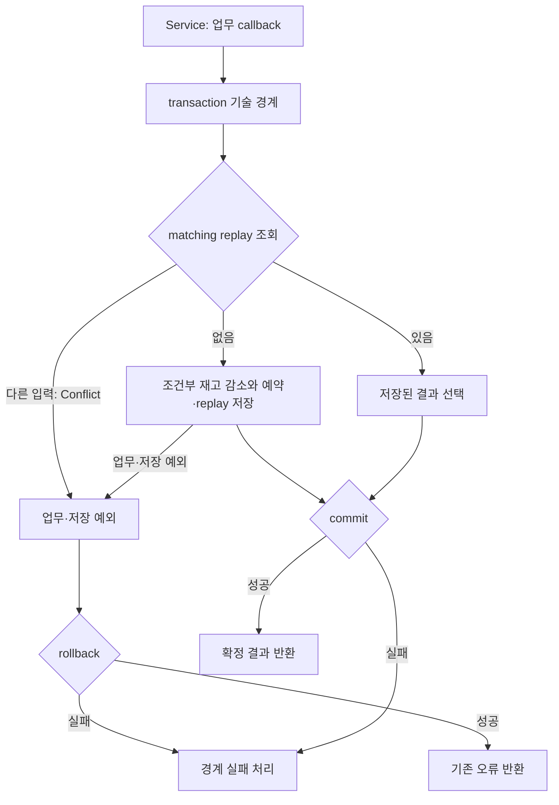

# 책임 정리 상태

Status: 2026-09-15 평가 기록 · Python replay 책임 선택은 2026-09-16 validation 분리로 대체

2026-09-15 기록에서 후속 [트랜잭션 실행 책임](transaction-boundaries.md)은 FA-1 유지 판정을 Python 구현 결과로 대체했고,
NestJS·Rails 후속은 당시 아직 제안이었습니다. 아래 내용에는 그 시점의 완료 기록도 포함됩니다.

이 문서의 아래 평가·Task 1~5 결과는 **2026-09-15 당시의 역사적 기록**입니다. 특히 FastAPI/NestJS/Spring의
`findMatchingReplay` 계열에 conflict 판정을 남긴 선택은 현재 전체 구현의 기준으로 읽지 않습니다.
Python 두 앱의 현재 선택은 [개발 원칙](../engineering.md#application과-입력-경계),
[FastAPI 구조](fastapi-structure.md#호출과-계약의-방향), [FastCRUD 설계](fastapi-fastcrud.md#런타임과-transaction-소유권)가 소유합니다.

## 현재 Python validation 책임 — 2026-09-16

FastAPI 기준선과 FastCRUD 변형은 각각 독립 `validation/reservations.py`를 둡니다. 저장 경계는 typed replay/product와
원자적 조건부 감소의 boolean 같은 DB 사실을 반환하고, validation은 DB 접근 없이 replay product 충돌과 product 존재를
검사합니다. Service는 조회·validation·변경·transaction을 조율하고 실제 조건부 감소가 실패한 뒤 존재를 확인해
`SoldOut`을 결정합니다. DB constraint·lock·claim 같은 기술 신호와 그 번역은 계속 infrastructure 경계의 책임입니다.

## 2026-09-15 당시 판정 요약 (대체됨)

이 문서는 당시 코드의 책임 검토 결과와 작게 나눈 후속 작업을 기록한다. 공통
정책을 복제하지 않고 [개발 원칙](../engineering.md), [Backend](../backend.md),
[관측](../observability.md), 각 구현 설계·검증 문서를 기준으로 삼는다. 아래의
테스트 매핑은 실제 파일을 가리킨다. 승인된 구현 항목과 검증 상태를 기록하며,
미실측 성능이나 별도 후속 기능의 완료를 뜻하지 않는다.

현재 구조는 대부분 업무 의미 repository와 Service의 업무 트랜잭션 경계를 이미 지킨다.
공통 UnitOfWork나 네 구현 공용 runner는 만들지 않는다. 다만 NestJS는 승인된 범위에서
업무에서 분리한 기술 실행 경계를 injectable `TransactionRunner`로 구현했다. FastAPI 두 앱은 후속 작업에서
작은 `@transactional` 경계를 구현했으며 공용 UnitOfWork/framework는 만들지 않았다. replay의 key/product 일치 판단은 저장된 replay를 읽는
repository의 업무 의미이며, reservation aggregate 저장도 한 repository 안에
남긴다. Spring의 제품 seed는 예약 Service에서 독립된 제품 소유자로 좁힌다.

위 그림은 멱등성을 제공하는 세 구현의 논리 흐름이다. Rails에는 replay가 아직 없다.
NestJS의 `T`는 실제 runner이고 FastAPI·Spring Boot에서는 각 기존 경계가 같은 논리 역할을 맡는다.
연결 획득과 begin 순서는 구현별로 유지한다. Spring의 claim 경합은 rollback 이후
별도 replay 조회로 처리하며 예약 업무를 무조건 재실행하는 자동 retry가 아니다.

완료는 flush가 아니라 commit 성공이다. 이 문서 작성 당시 FastAPI/Nest의 body 예외와 rollback 성공은 `rolled_back`,
commit/rollback boundary failure는 `failed`였습니다. 현재 Python의 `committed / failed` 계약은 후속 문서가 대체합니다. commit 뒤 release/cleanup 실패는
실제 DB 완료와 자원 cleanup 결과를 별도로 다루며 새 공통 계약을 만들지 않는다.
Nest runner도 이 결과를 숨기지 않고 callback/commit/rollback/release 오류를 구분한다.

## FastAPI

실제 경로는 `services/reservations.py:reserve`, `core/transactions.py:transactional`,
`repositories/reservations.py:seed_product/find_matching_replay/decrease_stock/save_*`,
`core/database.py:acquire_primary_connection`, `seed.py:seed`이다.

| 작은 작업 | 책임·파일/시그니처 | callsite 변화와 보존할 동작 | 검증 매핑 |
| --- | --- | --- | --- |
| FA-1 기술 경계 유지 판정 | **후속 구현으로 대체**. `@transactional`이 transaction/outcome·오류 번역을, Service가 업무 순서를 소유 | 같은 Session 중첩·rollback-only·동시 Task 거절 포함 | [transactional decorator 검증](fastapi-verification.md#transactional-decorator-검증--2026-09-15) |
| FA-2 replay 이름 명시 | **구현**. `find_matching_replay(session, key, product_id)`와 Service callsite로 변경 | key 없음/일치 replay/mismatch conflict의 세 갈래가 이름에 드러남. conflict policy를 Service로 이동하지 않고 response 불변 | [FastAPI replay 검증](fastapi-verification.md#replay-조회-명명-검증--2026-09-15) |
| FA-3 seed scope | **유지 확인**. `seed.py:seed(product_id, stock)`가 seed application flow, repository `seed_product(session, product_id, stock)`가 제품 upsert/no-reset 소유 | seed는 `ReserveRequest`의 기존 CLI 입력 검증을 유지하고, reservation service를 호출하지 않음. 최초 stock만 기록하고 반복 seed는 현재 stock 보존 | [FastAPI replay 검증](fastapi-verification.md#replay-조회-명명-검증--2026-09-15) |
| FA-4 오류/metrics 회귀 케이스 보강 | 기존 public signatures 유지; 필요할 때만 `DatabaseMetrics.record_transaction`/`record_acquisition`의 safe recording을 재사용 | metrics failure가 업무 오류를 덮지 않고, commit/rollback/cleanup precedence를 현재 의미로 고정 | [test_metrics.py](https://github.com/Dae-Jeong/BackendTemplate/blob/bdcdb60/python/fastapi/tests/test_metrics.py), [test_application_errors.py](https://github.com/Dae-Jeong/BackendTemplate/blob/bdcdb60/python/fastapi/tests/test_application_errors.py) — 기존 확인 범위, 추가 케이스는 **미실행** |

추가 케이스(구현 시): acquire 실패 중 metric 실패, body 예외 뒤 rollback 실패, commit
실패 후 같은 key 재시도, key mismatch가 재고를 바꾸지 않는지. `find_matching_replay`를 별도
ReplayRepository로 쪼개거나 generic transaction runner를 도입하는 것은 제외한다.

## NestJS

실제 경로는 `services/reservations.service.ts:reserve/reserveInTransaction`,
`repositories/reservations.repository.ts:findMatchingReplay/decreaseStock/save*/seed`,
`database/transaction-runner.ts:run`, `database/primary.ts:acquire/release`, `database/seed.ts`이다.

| 작은 작업 | 책임·파일/시그니처 | callsite 변화와 보존할 동작 | 검증 매핑 |
| --- | --- | --- | --- |
| NE-1 lease 경계 | **구현**. `TransactionRunner.run<T>`이 acquire→immediate transaction→release를 조립하고 `Primary`가 pool acquisition·timeout·dirty cleanup을 계속 소유 | acquire 실패에는 release하지 않고, acquire 뒤 begin/commit/rollback 실패에는 release를 시도. pool timeout 번역은 Primary에 유지 | [NestJS Task 10 검증](nestjs-verification.md#task-10-검증--2026-09-15) |
| NE-2 transaction 오류/metrics | **구현**. runner가 outcome metric과 SQLite busy 번역을 소유하고 Service는 업무 callback을 전달 | callback 오류+rollback 성공만 `rolled_back`; commit/rollback failure는 `failed`; commit 성공+release 실패는 `committed`. 원래 오류 identity와 기존 오류 우선순위 유지 | [NestJS Task 10 검증](nestjs-verification.md#task-10-검증--2026-09-15) |
| NE-3 replay 이름 명시 | **구현**. `findMatchingReplay(client, key, productId)`와 Service callsite로 변경 | key 없음/일치/mismatch를 method name과 repository가 드러냄. aggregate 저장·conflict policy 이동 없음 | [NestJS Task 10 검증](nestjs-verification.md#task-10-검증--2026-09-15) |
| NE-4 seed/Client ownership | **구현 범위 유지**. `database/seed.ts`는 business outcome metric 밖의 maintenance transaction을 명시적으로 조립; `TransactionClient`는 database runner가 소유 | 별도 ProductRepository/adapter 없음. seed 반복 시 기존 stock 불변이고 business transaction metric baseline을 바꾸지 않음 | [NestJS Task 10 검증](nestjs-verification.md#task-10-검증--2026-09-15) |
| NE-5 worker 연결 가독성 | **구현**. `Connection.settle`이 worker 응답 완료를 모으고 worker의 query method 실행은 명시적 분기로 정리 | `Primary`는 변경하지 않음. protocol·close/death·pending reject·transaction 상태·pool/metrics 의미 유지 | [NestJS Task 11 검증](nestjs-verification.md#task-11-검증--2026-09-15) |

추가한 focused test는 callback rollback 원래 오류, acquire 실패의 release 없음,
begin 또는 transaction boundary 실패의 release 시도, commit 성공 뒤 release 실패의 `committed`,
busy 번역과 metrics 실패 격리를 고정한다. 기존 실제 SQLite 검증은 deferred COMMIT 실패,
rollback 실패 dirty connection 폐기, replay mismatch의 재고 불변을 유지한다.
runner options·retry·replica·Interceptor·worker/Primary 재구현은 추가하지 않았다.

## Spring Boot

실제 경로는 `ReservationService.reserve/replay`, `ProductSeedService.seed`,
`ReservationAttempts.reserve`, `ReservationRepository.claim/findMatchingReplay/decreaseStock/saveReservationAndReplay`,
`ProductSeedRepository.seedIfAbsent`, `SeedConfiguration.seedProduct`이다.

| 작은 작업 | 책임·파일/시그니처 | callsite 변화와 보존할 동작 | 검증 매핑 |
| --- | --- | --- | --- |
| SP-1 paired save 이름 명시 | **구현**. `saveReservationAndReplay(Reservation reservation, String key)`와 Service callsite로 변경 | reservation row와 replay row가 paired write임을 이름으로 드러냄. `flush`는 완료가 아니며 public `@Transactional` proxy commit이 최종 경계 | [Spring Task 11 검증](spring-boot-verification.md#task-11-reservation-명명-검증) |
| SP-2 seed scope | **구현**. `SeedConfiguration.seedProduct`가 public transactional `ProductSeedService.seed(productId, stock)`를 호출하고, concrete `ProductSeedRepository.seedIfAbsent`가 find-then-persist를 소유 | `ReservationService`·`ReservationRepository`의 seed 제거. `!no-db` 생성자 DI, 음수 검증, 신규·반복 stock 의미 유지 | [Spring Task 12 검증](spring-boot-verification.md#task-12-제품-seed-책임-분리-검증) |
| SP-3 replay 이름/계약 유지 | **구현**. `ReservationRepository.findMatchingReplay(String key, String productId)`와 Service callsite로 변경 | conflict policy를 별도 service로 이동하지 않음. `ReservationAttempts`는 rollback 이후 별도 조회 경계 | [Spring Task 11 검증](spring-boot-verification.md#task-11-reservation-명명-검증) |
| SP-4 attempts 경계 문서화 | **유지 확인**. `ReservationAttempts.reserve(String productId, String key)`가 `IdempotencyClaimed` catch 후 `transactions.replay` 호출 | proxy rollback 완료 후 fresh read가 필요하므로 `ReservationAttempts`를 `ReservationService`에 합치거나 self-invocation으로 바꾸지 않음 | [Spring Task 12 검증](spring-boot-verification.md#task-12-제품-seed-책임-분리-검증) |

Spring에서는 `saveReservationAndReplay`가 현재 실제 동작의 명명 개선이다.
SP-3의 repository 메서드 이름은 `findMatchingReplay(String key, String productId)`로
확정한다. `ReservationAttempts`는 일반 retry façade가 아니라 rollback 완료 후
새 transaction에서 replay를 조회하는 경계다.

SP-2는 새 `services/ProductSeedService.java`의 public
`int seed(String productId, int stock)`에 `@Transactional(rollbackFor = Exception.class)`을
적용한다. 음수 stock 검증을 소유하며 생성자로 새 concrete
`repositories/ProductSeedRepository.java`를 주입받는다. repository의
`int seedIfAbsent(String productId, int stock)`는 기존 Spring Data `ProductRepository`와
`EntityManager`를 주입받아 조회·persist하고 별도 commit은 하지 않는다.
두 클래스의 profile은 기존과 같은 `!no-db`다. 기존 `ReservationService.seed`와
`ReservationRepository.seed`를 제거하며 `reserve` 내부에는 seed가 없다.
기존 find-then-persist 의미를 보존하며 동시 seed upsert 보장을 새로 주장하지 않는다.
[JpaPersistenceTest](https://github.com/Dae-Jeong/BackendTemplate/blob/bdcdb60/java/spring-boot/src/test/java/com/backendtemplate/repositories/JpaPersistenceTest.java)의
seed 호출도 변경 대상으로 포함한다.

## Rails

실제 경로는 `app/models/product_id.rb`, `product.rb`, `reservation.rb`,
`app/services/reservation_service.rb`와 해당 model/service tests이다. Rails의
ActiveRecord transaction·scope idiom을 유지하고 repository/base/strategy framework,
Rails idempotency 구현은 이 문서 범위가 아니다.

| 작은 작업 | 책임·파일/시그니처 | callsite 변화와 보존할 동작 | 검증 매핑 |
| --- | --- | --- | --- |
| RA-1 ProductId 순수 규칙 소유 | **구현**. `ProductId::MAX_LENGTH = 128`과 `ProductId.normalize(value)`가 canonical rule/error를 소유; Service는 그 예외만 기존 `InvalidInput` reason으로 매핑 | Product/Reservation이 상수를 공유하고 model/request/CLI 차이 유지. 호출자별 규칙 API·자동 strip callback 없음 | [Rails ProductId 검증](rails-verification.md#productid-책임-정리-검증) |
| RA-2 decrement 의미 고정 | **유지 확인**. `Product.decrement_stock(product_id:, timestamp:)`의 affected-row count가 reserve 가능 여부를 뜻함 | zero면 `exists_by_product_id?`로 ProductNotFound/SoldOut 구분; update_all의 atomic conditional update와 timestamp 유지. 반환 semantics를 boolean/exception으로 바꾸지 않음 | [Rails ProductId 검증](rails-verification.md#productid-책임-정리-검증) |
| RA-3 SQLite busy owner 보류 | **유지 확인**. `ReservationService.create`의 `sqlite_busy?` rescue와 별도 pool timeout을 유지 | 기술 오류 검출 helper 분리/변경은 실제 중복 또는 테스트 필요가 확인될 때 별도 task로 승인. model로 내리지 않음 | [Rails ProductId 검증](rails-verification.md#productid-책임-정리-검증) |
| RA-4 transaction/seed 경계 문서화 | **유지 확인**. `ReservationService.create`가 decrement+Reservation.create! 한 transaction, `Product.seed_unless_exists!`가 seed owner | seed 반복은 existing stock을 reset하지 않음. Rails idempotency/metrics는 별도 작업 | [Rails ProductId 검증](rails-verification.md#productid-책임-정리-검증) |

`ProductId.normalize(value)`는 strip한 String을 반환한다. nil·비문자열·빈 결과·길이
초과에는 `ProductId::Invalid < StandardError`를 발생시키며 `reason`은 각각
`REQUIRED`, `INVALID_TYPE`, `TOO_SHORT`, `TOO_LONG`이다. Service는 이 예외만 기존
`InvalidInput`으로 변환한다. 두 모델은 `ProductId::MAX_LENGTH`를 참조하며 중복 상수를
제거한다. 모델에 자동 strip callback은 추가하지 않고 과거 migration의 상수도 바꾸지 않는다.
새 `test/models/product_id_test.rb`에서 반환값과 네 오류를 검증하고 기존 모델·HTTP
테스트로 입력 경계별 계약을 보존한다. Rails의 128자·trim 규칙을 다른 구현의
64자·pattern 규칙으로 통일하지 않는다.

## 감사표: 적용 규칙과 조건

여기서 하네스는 글로벌 agent 운영 규칙과 저장소의 설계·검증 기준을 뜻한다.
자동 doctor나 규칙 검사에 통과했다는 뜻은 아니다. 아래 판정은 해당 원칙을
현재 코드에 적용한 정적 검토이며, 조건부 항목은 구현 후 검증이 필요하다.

| 규칙 출처 | 설계 verdict | 조건/적용 범위 |
| --- | --- | --- |
| [engineering: Repository](../engineering.md#db와-외부-연계가-추가될-때) | 조건부 — 업무 의미 조회·저장만 소유 | FastAPI/Nest replay·reservation aggregate는 기존 cohesive repository 유지 |
| [engineering: Application](../engineering.md#application과-입력-경계) | 적합 — Service가 업무 흐름·원자적 범위를 정함 | Nest의 기술 실행은 runner; DB SQL은 repository; HTTP DTO는 Service 안으로 들이지 않음 |
| [Backend transaction](../backend.md) | 조건부 — commit 성공만 완료 | flush/insert 반환을 성공으로 세지 않음; commit/rollback failure는 failed |
| [observability](../observability.md) | 조건부 — 경계별 의미 유지 | metrics failure가 원래 오류·응답을 덮지 않으며 구현별 label 의미를 섞지 않음 |
| [FastAPI structure](fastapi-structure.md) | 적합 — dependency/session 수명 기존 조립 유지 | decorator가 acquire를 outer transaction 안에서 한 번 수행; 공용 UoW/framework 금지 |
| [NestJS structure](nestjs-structure.md) | 적합 — runner가 lease를 조립하고 Primary가 pool/cleanup 소유 | Service가 pool timeout·busy를 번역하지 않음; dirty connection 폐기 필수 |
| [Spring structure](spring-boot-structure.md) | 조건부 — public proxy transaction 유지 | `ReservationAttempts`와 `ReservationService` self-invocation 분리 유지 |
| [Rails structure](rails-structure.md) | 조건부 — ActiveRecord idiom 유지 | repository/base/strategy/idempotency framework 도입 안 함 |
| [Runtime Review](../runtime-review.md) | 보류 — 미실측 성능 주장 금지 | 이 문서는 구조 제안만; 부하·용량 verdict 없음 |

## 작업 순서와 범위

각 작업은 아래 목표와 예상 결과를 갖는 독립 review 단위다.

### Task 1. FastAPI replay 명명 — 구현 완료

목표:
FA-2의 이름과 Service 호출을 변경한다. FA-1/3은 유지 판정이며 구현 작업이 아니다.

예상 결과:

- pool/connection 오류·metrics owner가 Primary/database 경계로 고정됨
- replay mismatch가 재고 변경 없이 repository에서 결정됨
- seed 반복 실행이 기존 stock을 재설정하지 않음

### Task 2. NestJS transaction runner와 replay 명명 — 구현 완료

목표:
NE-1/2의 승인된 runner 분리를 구현하고 NE-3의 메서드 이름과 Service 호출을 변경한다.
NE-4 seed maintenance transaction의 계측 범위는 유지한다.

예상 결과:

- `findMatchingReplay`가 일치 판단을 드러내고 경합·commit 실패 테스트가 유지됨
- Service는 `reserveInTransaction` 업무 흐름, runner는 기술 경계, Primary는 실제 pool/dirty cleanup을 소유함
- callback·boundary·release·metrics 실패의 outcome과 원래 예외가 구분됨

### Task 3. Spring paired save와 replay 명명 — 구현 완료

목표:
SP-1/3의 이름을 실제 저장·조회 계약에 맞추고 호출을 변경한다.

예상 결과:

- paired write와 matching read를 이름으로 확인할 수 있음
- rollback과 replay 검증 결과가 기존과 같음

### Task 4. Spring 제품 seed 분리 — 구현 완료

목표:
SP-2를 구현하여 seed를 제품 소유 흐름으로 분리한다. SP-4는 유지 판정이다.

예상 결과:

- `saveReservationAndReplay(reservation, key)` callsite가 하나의 cohesive 저장 의미를 드러냄
- `ReservationAttempts`가 proxy rollback 후 fresh replay read를 계속 담당함
- seed가 reservation service transaction API에 의존하지 않음

### Task 5. Rails ProductId 규칙 통합 — 구현 완료

목표:
RA-1의 단일 규칙을 구현한다. RA-2/4는 유지, RA-3 helper 추출은 보류한다.

예상 결과:

- 128 trim, 64 pattern, model/request/CLI 구분이 사라지지 않음
- affected-row count가 ProductNotFound/SoldOut 판정으로 유지됨
- SQLite busy와 pool timeout의 공개 오류 변환 owner가 분명함

각 task의 정적 수락 조건은 위 파일·시그니처·callsite가 실제 코드와 맞는 것이다.
동적 수락 조건(테스트/build)은 구현 후 별도 실행 기록으로 남기며, 아래 작업 순서에서는
통과를 주장하지 않는다.

Task 1~5와 NestJS worker 가독성 범위를 2026-09-15에 구현·검증했다. rename에는 기존 검증을
재사용했고 ProductId의 새 순수 규칙만 의미 있는 단위시험을 추가했다. FA-4와 추가 오류 케이스는
이번 범위에서 누락이 확인되지 않아 보강하지 않았으며 기술 경계를 재구현하지 않았다.

모든 작업의 완료 조건은 (a) 제안한 파일·메서드와 callsite가 실제 코드와 일치,
(b) 정상·실패·경합·재생에서 상태와 외부 호출 횟수가 기존과 동일,
(c) 위 매핑 테스트와 새 누락 케이스의 실행 결과를 별도로 기록하는 것이다.
각 실행 결과는 FastAPI·NestJS·Spring Boot·Rails의 구현별 검증 기록이 소유한다.
