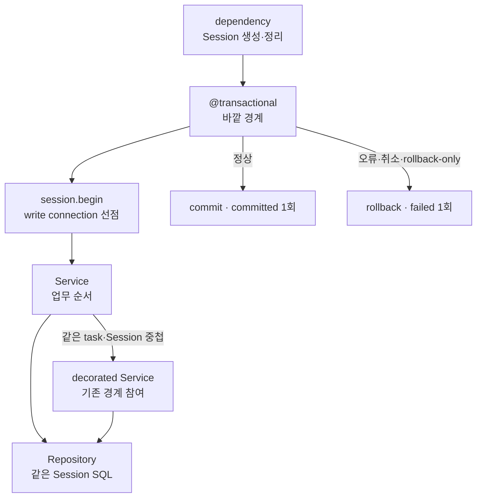

# 트랜잭션 실행 책임 정리

Status: **Python 구현 완료 · NestJS/Rails 제안 · Spring 유지 검토 제안** · 2026-09-15

서비스는 원자적으로 처리할 업무 범위를 정하고, DB 경계는 그 범위를 실행합니다.
이번 문서는 구현별 변경과 검증 상태를 소유합니다. 두 독립 Python 앱은 승인된
`@transactional` 경계를 구현했으며 NestJS·Rails 변경과 Spring 유지 검토는 아직 제안입니다.
[기존 책임 정리](responsibility-cleanup.md)의 FastAPI 유지 판정은 이 구현으로 대체합니다.

## ADR: 업무 범위와 기술 실행 분리

변경 전 FastAPI 두 구현은 서비스가 연결 확보·DB 오류 번역·계측까지 처리했습니다.
NestJS는 책임을 분리했지만 runner 내부에 예외 객체 비교가 남아 있습니다.
Spring Boot는 transaction manager/listener로 분리돼 있으며, Rails는 서비스가 SQLite 오류를 판별합니다.

**결정:** 라이브러리의 transaction API를 유지하고, 기술 처리를 작은 구현별 경계에 모읍니다.
전 구현 공용 UnitOfWork, 자동 요청 transaction, 재시도 framework는 만들지 않습니다.
단순히 중첩 코드를 옮기지 않고 FastAPI/NestJS의 결과 계측을 단순화합니다.
Spring은 실제 완료 callback이 있으므로 기존 세 결과를 유지합니다.



그림은 구현된 Python 파일 흐름입니다. Session lifetime은 dependency가, transaction은 decorator가,
업무 순서는 Service가 소유합니다. NestJS는 현재 callback runner 구조를 유지합니다.

## 오류와 관측 계약

| 상황 | Python 구현·NestJS 후속 제안 동작 |
| --- | --- |
| commit까지 정상 완료 | `committed`; 이후 호출자에게 결과 반환 |
| 획득·begin·업무·commit·rollback 실패 또는 취소 | `failed`; rollback 성공 여부를 추론하지 않음 |
| commit 후 자원 정리 실패 | DB 결과는 `committed`, 호출은 정리 오류로 실패할 수 있음 |
| 업무 실패 후 rollback 실패 | ORM이 내보내는 종료 오류와 cause/context 보존 |
| transaction 오류와 release 오류 동시 발생 | 이번에는 기존 구현별 우선순위 유지; Nest는 release 오류가 우선하며 이전 오류 보존 여부를 검증 |
| metrics 기록 실패 | 업무 결과·원래 예외·취소를 덮지 않음 |

`failed`는 commit 성공을 확인하지 못한 실행 결과이며 DB의 rollback 확정이나 미반영 보장이 아닙니다.
commit 실패 뒤 자동으로 예약 업무를 재실행하지 않습니다. 기존 멱등 재생 계약을 유지합니다.
알려진 pool timeout·SQLite busy만 애플리케이션 DB 오류로 변환하고 나머지는 그대로 전파합니다.
로그는 기존 최외곽 예외 처리 경계에서 한 번 남기며 새 경계에서 중복 출력하지 않습니다.

**관측 변경 영향:** FastAPI 두 앱은 `rolled_back` series 생성을 제거하고 해당 실패를 `failed`로 기록합니다.
metric 이름과 duration 측정 범위는 유지합니다. 과거 수치와 새 `failed`의 의미가 다릅니다.
Nest도 후속 구현 시 같은 변경과 dashboard/query 참조를 함께 검토합니다. Spring의 `rolled_back`과 언어를
가로질러 같은 뜻으로 합산하지 않습니다.

## FastAPI · FastCRUD — 구현 완료

각 독립 앱에 같은 책임을 구현하고 앱 간 공유 패키지는 만들지 않습니다.

| 파일 | 구현 책임 |
| --- | --- |
| `core/transactions.py` 신규 | `@transactional`. `session.begin()`, 쓰기 연결 확보, DB 오류 번역, 중첩 상태와 결과·시간 계측 |
| `core/database.py` 기존 | Engine·Session factory, SQLite 설정, 연결 획득과 acquisition 계측 유지 |
| `services/reservations.py` | `@transactional`을 붙인 예약 업무 흐름. SQLAlchemy 예외·SQLite 코드·시간 측정·outcome 추적 제거 |
| `dependencies/database.py` 기존 | Session 생성·정리 유지. transaction 자동 commit 추가 없음 |
| `contracts/database.py`, `core/database_metrics.py` | 두 outcome 및 등록 label 반영 |

호출 형태:

```python
@transactional
async def save_order(
    *, session: AsyncSession, metrics: DatabaseMetrics, order_id: str
) -> str:
    await orders.save(session, order_id)
    return order_id
```

`session`과 `metrics`는 이름을 탐색하지 않는 required keyword-only 계약입니다. `ParamSpec`과 `wraps`로 원래
호출 타입·signature를 보존합니다. 주입을 감추는 전역 registry·ContextVar·Session subclass는 없습니다.
상태는 해당 Session의 `info`에만 두며 종료마다 제거합니다.
취소는 잡아서 다른 오류로 바꾸지 않으며 `finally`에서 안전한 계측만 수행합니다.
`BEGIN IMMEDIATE` 연결 확보는 첫 멱등 조회보다 먼저, `session.begin()` 안에서 수행합니다.
같은 asyncio Task와 같은 Session의 decorated 중첩 호출만 바깥 경계에 참여합니다. 내부 실패를 바깥 업무가
잡아도 rollback-only가 유지되어 바깥 종료 시 `TransactionRollbackOnly`를 원인과 함께 내보냅니다.
다른 Task의 동시 재사용은 소유 상태를 건드리지 않고 거절합니다. 사전/autobegin transaction은 시작·종료·계측하지 않습니다.
decorated scope 안의 수동 commit/rollback은 지원하지 않으며, 종료 시 소유권 훼손을 감지하더라도 이미 수동 commit된
데이터의 원복을 보장하지 않습니다. `begin_nested()`는 자동 전파나 SAVEPOINT 지원 계약이 아닙니다.
REQUIRES_NEW·readOnly·Replica routing·retry 옵션은 구현하지 않았습니다.
FastCRUD의 `commit=False`, audit timestamp·soft-delete·기존 snapshot 재생은 그대로 유지합니다.

## NestJS

서비스의 `transactions.run(client => ...)`와 명시적 client 전달은 유지합니다.
`database/transaction-runner.ts`에서 callback을 다시 `try/catch`로 감싸는 부분과 `bodyError`만 제거합니다.
Drizzle transaction이 정상 반환한 직후 `committed`로 바꾸고 나머지는 `failed`로 둡니다.

acquire 이후 release를 보장하는 `try/finally`는 필요하므로 유지합니다. 모든 중첩 문법을 없애는 것이 목표는 아닙니다.
`Primary`의 pool timeout·dirty connection 폐기 책임, immediate transaction, transaction client 타입을 유지합니다.
`contracts/observation.contract.ts`·`observability/database.metrics.ts`의 outcome과 관련 테스트 기대값을 함께 변경합니다.
Prisma 전환, worker/Primary 재작성, Interceptor·decorator 도입은 이번 범위 밖입니다. 현재 대상 코드는 Drizzle입니다.

## Spring Boot

`ReservationService`의 public `@Transactional`과 `JpaTransactionManager`를 유지합니다.
`TransactionMetrics` listener는 실제 완료 callback을 이용하므로 `committed / rolled_back / failed`를 유지합니다.
새 runner·AOP·서비스 `try/catch`를 추가하지 않습니다.
`ReservationAttempts`가 실패 transaction의 rollback 이후 새 proxy 호출로 replay하는 순서와 오류 번역을 회귀 검토합니다.
정적 검토로 구체적인 누락이 확인되지 않으면 production 코드 변경 없이 기존 시험으로 수락합니다.

## Rails

Active Record block 형태를 유지하되 작은 `Database::Transaction.run { ... }`이 transaction과 DB 오류 번역을 실행합니다.
서비스의 입력 오류 변환과 `ProductNotFound / SoldOut` 판단은 그대로 둡니다.

| 파일 | 제안 책임 |
| --- | --- |
| `app/lib/database/transaction.rb` 신규 | `ApplicationRecord.transaction` 실행 후 바깥에서 ActiveRecord pool timeout·SQLite busy 변환. SQL 실행 실패를 block 안에서 삼키지 않음 |
| `app/lib/database/errors.rb` 신규 | `Database::Errors::Busy`, `PoolTimeout` 기술 오류. DB 계층이 Service 상수를 참조하지 않음 |
| `app/services/reservation_service.rb` | transaction block 안에 조건부 차감·예약 생성만 표현. SQLite cause 탐색과 기술 예외 클래스 제거 |
| `app/controllers/v1/reservations_controller.rb` | 새 기술 오류 클래스에 기존 503 code·Retry-After 매핑. HTTP 응답 불변 |

Zeitwerk 상수 로딩을 검증합니다. 내부 예외 상수 경로 변경에 맞춰 테스트·호출자를 함께 갱신하고 불필요한 alias는 남기지 않습니다.
transaction에는 옵션·retry·중첩 기능을 추가하지 않습니다. 쓰기 block의 정상 완료 뒤에만 결과를 반환합니다.
조회 `find`, seed, 다른 DB pool, Rails 멱등성·metrics 도입까지 범위를 넓히지 않습니다.

## 구현 Task와 수락 조건

### Task 1. FastAPI 기준선 책임 분리 — 완료

목표: `core/transactions.py`와 서비스 호출을 구성하고 관측 계약 변경을 문서·label·참조에 반영합니다.

예상 결과:
- 서비스에 DB 코드 판별·transaction 계측·예외 identity 비교가 없음.
- 정상 commit, 업무 실패 원복, acquire 실패, commit/rollback 실패, 취소, metrics 실패 격리 시험이 통과함.
- 실제 SQLite 동시성·멱등성·응답 계약과 Session 반환이 유지됨. 문법을 복제한 테스트 helper는 실제 새 경계를 호출함.

### Task 2. FastCRUD 변형 적용 — 완료

목표: Task 1에서 검증한 책임 분리를 독립 FastCRUD 앱에 적용합니다.

예상 결과:
- FastCRUD `commit=False`와 바깥 원자성, 상품 삭제 후 replay, audit 필드 및 rollback 검증이 유지됨.
- Task 1 실패 시나리오와 기존 변형 전체 검증이 통과함. migration·로컬 데이터 변경이 없음.

### Task 3. NestJS 실행 경계 단순화

목표: runner의 예외 identity 추적을 제거하고 outcome 정의와 문서를 갱신합니다.

예상 결과:
- acquire 실패 시 release 없음, 획득 후 정확히 한 번 release, dirty connection 재대여 금지가 유지됨.
- commit/rollback/release 실패 조합과 metrics 장애 시험이 통과함. commit 후 release 실패는 `committed`임.
- 실제 SQLite 경합·멱등 재생·HTTP 오류 계약이 유지됨.

### Task 4. Rails DB 오류 책임 분리

목표: transaction 실행·기술 오류 타입을 서비스에서 분리하고 controller 매핑을 연결합니다.

예상 결과:
- 서비스에서 ActiveRecord/SQLite 기술 예외 판별이 제거되고 기존 503 응답이 유지됨.
- Zeitwerk 검사, insert 실패의 재고 원복, 실제 잠금·pool timeout, 기존 예약·경합 시험이 통과함.

### Task 5. Spring Boot 유지 검증과 문서 정합성

목표: 기존 proxy·listener 경계를 검토하고 구현별 설계 및 검증 기록을 실제 완료 상태와 맞춥니다.

예상 결과:
- rollback 후 replay·commit 실패·metrics 실패 격리 시험으로 기존 경계 유지 근거가 남음.
- 구현된 각 task의 파일·명령·결과가 기록되고 이전 유지 판정과 모순되는 현행 설명이 없음.
- MkDocs strict build와 실제 Mermaid 렌더링이 확인됨.

Python Task 1·2는 기존 실패 검증을 유지·확장해 구현했습니다. Task 3~5는 후속 검토 시 독립 커밋으로
다루며, 관측 기대값만 승인된 정의에 맞추고 DB 상태 검증은 유지합니다.

## 설계 검토

[개발 원칙](../engineering.md)의 예외 번역 경계·명시적 의존성·작은 모듈 기준에 맞춥니다.
업무가 원자적 범위를 정한다는 [Backend](../backend.md) 계약은 유지합니다.
관측 변경은 [관측](../observability.md)과 구현별 문서에 명시하며 미확인 rollback을 성공으로 기록하지 않습니다.
프레임워크 transaction 구현을 대체하지 않고, Spring까지 다른 언어의 wrapper로 통일하지 않습니다.

참고: [SQLAlchemy Session 생명주기](https://docs.sqlalchemy.org/en/20/orm/session_basics.html#when-do-i-construct-a-session-when-do-i-commit-it-and-when-do-i-close-it).
Python의 API 배치와 outcome 축소는 이 저장소의 구현 선택이며 프레임워크가 강제하는 표준은 아닙니다.
NestJS·Rails 변경과 Spring 유지 검토는 아직 제안입니다.
